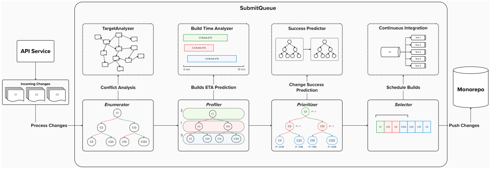
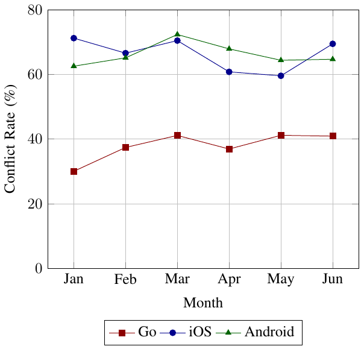
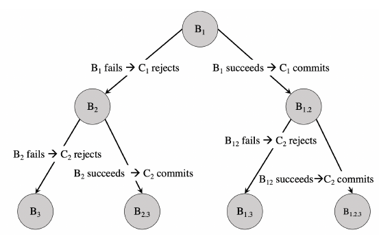
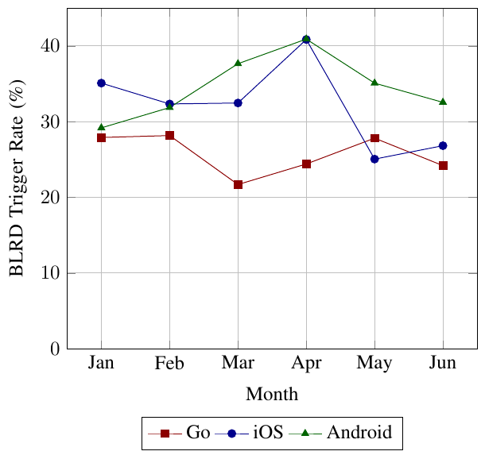
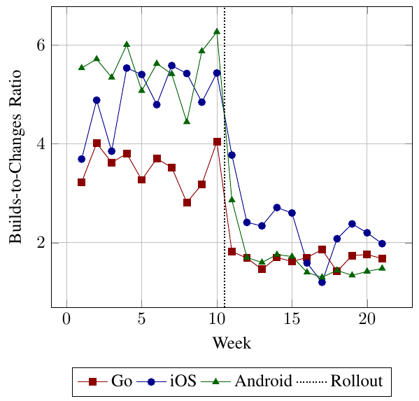
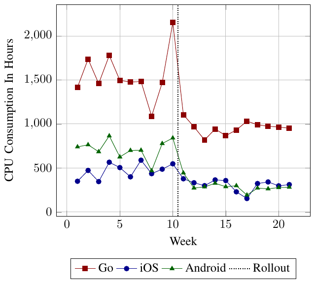
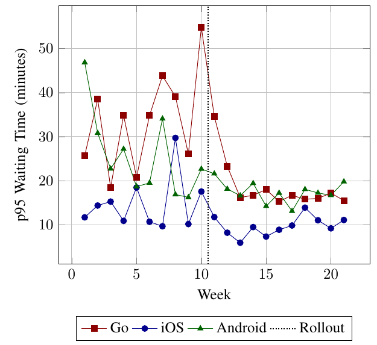

# 大规模 CI：精简、常绿且快速

> 原文：[CI at Scale: Lean, Green, and Fast](https://arxiv.org/html/2501.03440v2) · [原始 PDF](paper.pdf)\
> 作者：Dhruva Juloori、Zhongpeng Lin、Matthew Williams、Eddy Shin、Sonal Mahajan\
> 机构：Uber Technologies, Inc., USA\
> 首次提交：2025-01-07；本译文依据 v2（2025-05-19）；记录：2026-09-05\
> 许可：[CC BY 4.0](https://creativecommons.org/licenses/by/4.0/)。本文件是中文翻译，保留作者署名、原文公式和图表；参考文献保留原语种。图 3 沿用原文对既有研究的署名说明。翻译及 Markdown 排版不代表原作者背书。\
> 阅读说明：正文中的“我们”指论文作者；对推导前提、数据口径和开源仓库的补充放在[阅读笔记](notes.md)。文献编号与原论文一致，链接见文末。

## 摘要

在节奏快、规模大的软件开发环境中，保持主线分支“常绿”，即所有构建均成功通过，至关重要，也充满挑战，尤其是在大型单体仓库中存在并发代码变更时。为解决这些问题而设计的 SubmitQueue 通过推测执行构建，只将验证成功的变更合入主线。尽管这种方法有效，系统的资源利用仍不够高效：大量构建被提前中止，较小变更也会被前面较大且存在冲突的变更阻塞，迟迟无法合入。

本文介绍对 SubmitQueue 的改进，重点是优化资源使用和构建优先级。核心是一种新的概率模型，它区分构建耗时较短与较长的变更，以便通过构建优先级实现更高效的调度。我们使用机器学习模型预测构建时间，将预测结果纳入概率框架，从而加快那些被较大、耗时且冲突的变更阻塞的小变更的合入。此外，我们引入推测阈值，只执行最可能需要的构建，减少不必要的资源消耗。

在 Uber 的主要单体仓库 Go、iOS 和 Android 中实施这些改进后，我们观察到持续集成（CI）资源使用量约减少 53%，CPU 使用量减少 44%，P95 等待时间减少 37%。这些改进表明，SubmitQueue 在保持主线常绿的同时，能够更高效地管理大规模软件变更。

**关键词：** 持续集成、合并队列、单体仓库、构建时间预测、构建调度、概率建模、推测执行、版本控制。

## I 引言

在现代软件开发中，尤其是大型、快速发展的科技公司里，数百名工程师会频繁地向同一个仓库提交变更 [1]。这带来一个重大挑战：如何高效管理这些变更、迅速解决冲突，并确保主线保持常绿。如果仓库历史中的每个提交点都能成功执行编译、单元测试和 UI 测试等全部构建步骤，主线便是常绿的。常绿主线是快速开发和部署周期的重要基础。但正如研究 [2] 所指出的，随着代码库规模与复杂度增加，一边快速合入变更、一边保持主线常绿越来越困难；大量开发者并发提交变更又加重了这一问题。

GitHub Merge Queue [3]、GitLab Merge Train [4]、LinkedIn 的合并前验证 [5]、Airbnb 的 Evergreen [6] 以及类似方案 [7]、[8] 都致力于保持主线常绿，但它们在兼顾快速合入方面往往仍有不足。这些方法有的缺少推测执行，有的缺少冲突处理。当队列中靠前的变更失败，或变更流量很高时，就会消耗大量资源，并延长合入时间。

SubmitQueue 遵循研究 [9] 中的原则，旨在保持主线常绿的同时高效合入变更。Uber 全球有四千多名工程师，维护数千个微服务和数十款移动应用，系统每月处理数万项变更。这个规模涉及六个主要单体仓库、七种编程语言和数亿行代码。SubmitQueue 每月支持数十万次部署，并处理数百万项配置变更。在如此高速的开发环境中，顺畅、高效且快速地集成变更，对于服务可靠性、运行稳定性和开发者生产力都至关重要。

SubmitQueue 会推测所有待处理变更的结果，构建一棵推测树，列出当前系统内变更的所有可能构建。它结合概率模型和机器学习模型，为最可能成功的构建赋予优先级，并行执行它们，以缩短合入时间。这保证只有通过全部必要检查的变更才能合入，从而维护主线的完整性。此外，SubmitQueue 会分析变更间的冲突，对推测树剪枝，让独立变更能够并发构建。

SubmitQueue 虽然解决了许多主线常绿问题，但仍有局限。既有研究 [9] 描述了一种策略：如果预测新到变更的构建比正在执行的构建更可能成功，系统会中止正在执行的构建。这造成两个关键问题：

1. **资源使用量高。** 大量构建被提前中止；据估计，在 Uber 的主要单体仓库中，受影响的构建占 40%–65%。这些变更随后又需要安排额外构建。
2. **等待时间增加。** SubmitQueue 按变更提交顺序处理。因此，构建耗时短的变更如果排在一个耗时长的大变更后面，就必须等待大变更被提交或拒绝后才能继续。

绕过大变更（Bypassing Large Diffs，BLRD）[10] 将可交换性引入变更排序，部分解决了等待时间过长的问题。根据 BLRD，如果小变更被前面耗时长、存在冲突的大变更阻塞，而小变更的全部推测构建都已完成且结果一致，就可以安全地绕过大变更，根据验证结果合入或拒绝小变更。然而，大多数情况下，小变更的全部推测构建并未得到验证，因为它们没有被优先调度。原因在于，既有概率模型 [9] 假定决定一个变更只需要一个构建，而且无法区分短构建与长构建，以相应调整优先级。因此，小变更即使有机会越过队列前面的大变更，也仍会因相关推测构建未获优先级而长期等待。

解决这些局限有两个重要原因。首先，资源利用会直接影响运营成本，在开发速度快的科技公司尤其如此。据估计，Google、Mozilla 等公司的大型 CI 系统每年花费可达数百万 [11]。低效的构建优先级会进一步推高成本，对预算有限的公司构成采用 CI 实践的重大障碍。其次，较长的等待会降低系统效率，开发者因变更无法及时合入而损失生产力。

本文提出一系列 SubmitQueue 改进，通过优化资源使用和构建优先级减少等待时间。具体来说，我们提出改进的构建优先级策略：使用机器学习预测构建时间，再通过新的概率模型判断变更是否具备绕过资格，从而更有效地安排构建。另外，我们提出推测阈值，使系统只调度最可能需要的构建，进一步提高效率。

在 Uber 的 Go、iOS 和 Android 主要单体仓库中实施后，关键指标显著改善：CI 资源使用量下降 53%，每周 CPU 小时数下降 44%，P95 等待时间下降 37%。这些结果说明，改进实现了更高效的资源利用、更少的消耗和更快的变更合入。

本文首先介绍背景，说明常绿主线的重要性及相关挑战；接着概述 SubmitQueue，介绍 BLRD [10]、绕过资格、构建完成时间估计和基于概率的构建优先级。随后讨论推测阈值及其对调度的影响，再深入介绍策略的实现与评估，最后给出结论和未来工作。

## II 背景

### II-A 稳定主线的重要性

如第 I 节所述，在大规模、高速开发环境中，保持所有构建均通过的常绿主线至关重要。它带来稳定性，支持顺畅的持续集成、快速开发周期和持续部署更新。

正如研究 [9] 所指出的，主线一旦“变红”，也就是出现失败，就会触发一连串问题，严重影响生产力、开发进度和整体稳定性：

- **发布延迟。** 变红的主线会阻碍新功能与安全补丁部署。在上市速度很重要的行业，这可能造成经济损失。研究 [12] 表明，有效实施 CI/CD 的组织，相比低绩效组织，部署频率高 46 倍，从提交到部署的速度快 440 倍，从停机中恢复的速度快 170 倍。这凸显了发布延迟对收入的影响。
- **回滚成本。** 失败发生后，工程师必须恢复到最近的稳定状态，通常要进行复杂的 cherry-pick 操作，耗费大量资源。一项针对 Atlassian 项目在 2021–2023 年间的研究 [13] 发现，CI 构建失败导致每个项目每年平均浪费 120 小时构建时间，带来可观成本。
- **生产力下降。** 变红的主线会导致本地构建失败，打断开发工作，并迫使开发者在以后可能被回滚的代码上继续工作。研究 [14] 表明，构建稳定性等过程指标能够很好地反映开发者生产力。不稳定的构建和频繁回滚会严重干扰工作流，让开发者浪费精力、感到挫败，并花时间修复本可通过稳定主线避免的问题。

### II-B 其他方法及其局限

GitHub Merge Queue [3] 和 GitLab Merge Train [4] 都会在合并前依次测试各项变更。虽然支持并行测试，它们只推测成功路径。如果队列前面的变更失败，后续变更必须在移除失败变更后重新测试，在失败率高时尤为耗时。这两种方法还缺少基于依赖图的冲突检测，因此即使是无关变更失败，也可能引发不必要的测试重启，进一步延迟后续变更。

图 1：SubmitQueue 架构。

Airbnb 的 Evergreen [6] 通过冲突分析、并行验证独立变更，解决大型单体仓库中的变更可串行化问题。但它在高冲突期和高变更流量下仍有不足。如果队列前面变更的合并前测试很长，后面已经构建完成的变更仍然必须等待，从而限制系统在快速开发环境中的扩展能力。此外，如果前面的测试容易失败，后续变更可能反复重测，造成资源浪费。

Aviator Merge Queue [7] 与 SubmitQueue 类似，会对待处理变更执行推测构建并进行冲突分析。它引入“截止分数”（cutoff score），判断哪些推测路径值得构建。设置截止分数虽然能够减少资源使用，但单靠这一点并不够。在高负载下，与大变更冲突的小变更要么等待大变更完成，要么因为分数低于截止值而推迟构建，最终影响合入时间。

### II-C 为什么需要稳健的变更管理系统

考虑到其他方法的局限，我们需要更全面的解决方案来适应现代软件开发的规模与并发度。SubmitQueue 这类系统通过推测执行构建，仅合入通过所有必要检查的变更，在主线损坏之前阻止问题发生。

部署这类系统，可以帮助不同规模的公司提高开发者生产力、加快发布周期并保障软件质量。它们维持稳定可靠的主线，减少并发变更引起的干扰与瓶颈。本文在这些基础上进一步优化资源使用、缩短等待，并改进构建优先级，以提升整体表现。

## III 系统概览

变更通过 API 服务提交给 SubmitQueue 后，会进入一个分布式队列。核心服务由多个组件组成，为队列中的每个变更执行全部必要构建步骤，最终决定合入还是拒绝，并给出拒绝原因。图 1 展示了系统的高层架构。

### III-A 枚举器（Enumerator）

枚举器处理待提交变更队列，构建推测树，列出当前变更的所有可能构建。它通过目标分析器识别潜在冲突，从而执行两项工作：一是剪掉不必要的推测，提高剩余推测被执行的可能性；二是识别能够并行构建的独立变更，提高吞吐量。

### III-B 剖析器（Profiler）

剖析器接收枚举器生成的推测树，为每棵树生成一份剖析信息，记录树内各变更相关的绕过关系。构建时间分析器预测推测树节点的构建耗时，使剖析器能够准确识别每个变更所关联的绕过变更。

### III-C 优先级计算器（Prioritizer）

优先级计算器利用推测树剖析信息中的绕过数据，以及 SubmitQueue 中各变更的成功概率分数，计算树上每个节点的“构建被需要的概率”，并据此排序。成功概率由机器学习驱动的成功预测器给出，帮助系统作出更有依据的优先级决策。

### III-D 选择器（Selector）

选择器处理排好优先级的构建，执行三项操作：调度高概率构建到 CI 执行；中止不在最新优先构建集合中的进行中构建；在变更满足全部合入标准后，将它安全地提交到单体仓库。

## IV 绕过大变更（BLRD）

SubmitQueue 会并行执行构建，提前计算结果。但只有在对应构建完成并到达树的头部时，才决定提交或拒绝变更。因此，在大变更之后到达、与之冲突的小变更，即使构建更早完成，也常常被延迟。影响大量构建目标的大变更，可能与之后几乎所有进入 SubmitQueue 的变更冲突。图 2 显示，单体仓库中的冲突非常频繁；冲突数量越多，推测树越深，延迟也越严重。

图 2：2024 年 1–6 月，Go、iOS 和 Android 单体仓库的月度冲突率。

如第 I 节所述，如果小变更在前面存在冲突的大变更的各种推测情况下都得到相同结果，BLRD [10] 就能加快小变更合入。

图 3：按顺序到达的冲突变更 $C_1$、$C_2$、$C_3$ 对应的构建推测树 [9]。原论文注明：此图经作者许可转载自既有研究 [9]。

在图 3 中，$H$ 表示仓库当前 HEAD，$C_1$、$C_2$、$C_3$ 是待提交的冲突变更。$C_1$ 是耗时较长的大变更，$C_2$ 则较小、较快。定义如下构建步骤：

- $B_1$：在 $H$ 上对 $C_1$ 执行构建步骤。
- $B_2$：在 $H$ 上对 $C_2$ 执行构建步骤。
- $B_{1.2}$：在 $H+C_1$ 上对 $C_2$ 执行构建步骤。
- $B_{1.2.3}$：在 $H+C_1+C_2$ 上对 $C_3$ 执行构建步骤。
- $B_{1.3}$：在 $H+C_1$ 上对 $C_3$ 执行构建步骤。
- $B_{2.3}$：在 $H+C_2$ 上对 $C_3$ 执行构建步骤。
- $B_3$：在 $H$ 上对 $C_3$ 执行构建步骤。

令 $M(S,C)$ 表示将变更 $C$ 应用于状态 $S$ 后的主线状态。SubmitQueue 会分别在当前 HEAD 上测试 $C_2$（$B_2$），以及在应用 $C_1$ 后测试 $C_2$（$B_{1.2}$）。如果两个推测构建得到相同结果，那么合入 $C_2$ 的结果就不依赖于 $C_1$ 是先合入还是后合入。在这种情况下，$C_1$ 仍在进行时，就可以安全地合入 $C_2$，并保证：

$$
M(M(H,C_1),C_2)=M(M(H,C_2),C_1).
$$

这说明 $C_1$、$C_2$ 的合入顺序具有可交换性。关于 BLRD 的更多细节和完整证明，请参见文献 [10]。

图 4：2024 年 1–6 月，Go、Android 和 iOS 单体仓库的 BLRD 月度触发率。

BLRD 触发率定义为发生绕过的变更数量与因进行中的冲突构建而必须等待的变更总量之比。各仓库的比率在 0%–45% 之间，表明在优化小变更绕过、减少推测树前方大变更造成的延迟方面，还有很大改善空间。

## V 概率模型

SubmitQueue 根据构建被需要的可能性来安排优先级，以优化资源使用。根据文献 [9]，概率 $P^{\text{needed}}_{B_C}$ 表示构建 $B_C$ 的结果会被用于决定提交还是拒绝变更 $C$ 的可能性。既有研究提出的概率模型基于两个假设：

1. 决定一个变更的结果只需要一个构建。
2. 变更按进入队列的顺序合入主线。

引入 BLRD [10] 后，这些假设不再成立。如第 I、IV 节所述，若小变更的全部推测构建能在前面存在冲突的大变更完成之前结束，并得到一致结果，BLRD 就允许小变更绕过大变更。因此，SubmitQueue 必须为每个变更评估多个构建，确保符合条件的小变更能够绕过大变更。

旧模型假设单个构建即可决定变更命运，已经不够用：BLRD 要求对全部推测构建给予同等优先级，以评估是否能够绕过。但验证所有构建很昂贵，因为构建数量会随推测树深度呈指数增长。因此，引入 BLRD 后，概率模型必须在优化资源使用的同时，通过构建优先级加快变更合入。

### V-A 增强的概率模型

新模型应关注两个关键目标：

1. **优先调度可能发生绕过时所需的推测构建。** 当变更有机会绕过队列前方较大且存在冲突的变更时，应对符合条件变更的所有推测构建赋予相同优先级，让小变更迅速合入。
2. **对于不进行绕过的变更，只调度推测树中最可能的路径。** 如果一个变更的构建很可能在前方冲突变更合入或被拒绝后才完成，就只需优先安排最必要的推测构建，因为一个构建便足以决定结果。

以图 3 中的多个冲突变更为例，定义完成时刻如下：

- $C_1$ 的完成时刻 $FT_1$：构建 $B_1$ 完成的时刻。
- $C_2$ 的完成时刻 $FT_2$：构建 $B_{1.2}$ 和 $B_2$ 都完成的时刻。
- $C_3$ 的完成时刻 $FT_3$：构建 $B_{1.2.3}$、$B_{1.3}$、$B_{2.3}$、$B_3$ 全部完成的时刻。

这里，$P(FT_y<FT_x)$ 表示变更 $C_y$ 比变更 $C_x$ 更早完成的概率。该概率决定哪些构建有必要执行，并影响调度和优先级。如果 $C_y$ 的构建不太可能在 $C_x$ 之前完成，就几乎没有使用 BLRD 的机会，只需基于 $C_x$ 最可能的结果来推测 $C_y$。

#### 情形 1：$FT_1<FT_2<FT_3$

在这种情况下，$C_1$ 先于 $C_2$ 完成，$C_2$ 又先于 $C_3$ 完成，没有绕过机会。树根 $B_1$ 总是必需的，用来决定 $C_1$ 的命运。相关概率为：

$$
P^{\text{needed}}_{B_1}=1
$$

$$
P^{\text{needed}}_{B_{1.2}}=P^{\text{success}}_{B_1},\quad
P^{\text{needed}}_{B_2}=1-P^{\text{success}}_{B_1}
$$

$$
P^{\text{needed}}_{B_{1.2.3}}
=P^{\text{success}}_{B_1}\times P^{\text{success}}_{B_2}
$$

这种情形正是既有研究 [9] 的概率模型主要关注的情况。

#### 情形 2：$FT_2<FT_1<FT_3$

$C_2$ 的所有构建有可能先于 $C_1$ 完成，使 $C_2$ 绕过 $C_1$。此时需要同时取得 $B_2$ 和 $B_{1.2}$ 的结果，才能决定 $C_2$ 是否先于 $C_1$ 合入。概率为：

$$
P^{\text{needed}}_{B_2}=P^{\text{needed}}_{B_{1.2}}=P(FT_2<FT_1)
$$

由于 $C_3$ 最后完成，它的构建仍取决于 $C_1$ 和 $C_2$ 的结果。

#### 情形 3：$FT_1<FT_3<FT_2$

另一种可能是 $C_1$ 先于 $C_3$ 完成，而 $C_3$ 先于 $C_2$ 完成。当 $C_3$ 使用 BLRD 时，$C_2$ 的构建结果不再影响 $C_3$ 所需的构建。为了让 $C_3$ 绕过 $C_2$，各个构建被需要的概率为：

$$
P^{\text{needed}}_{B_{1.2.3}}=P^{\text{success}}_{B_1}\times P(FT_3<FT_2)
$$

$$
P^{\text{needed}}_{B_{1.3}}=P^{\text{success}}_{B_1}\times P(FT_3<FT_2)
$$

$$
P^{\text{needed}}_{B_{2.3}}=P^{\text{failure}}_{B_1}\times P(FT_3<FT_2)
$$

$$
P^{\text{needed}}_{B_3}=P^{\text{failure}}_{B_1}\times P(FT_3<FT_2)
$$

#### 情形 4：$FT_3<FT_2<FT_1$

$C_3$ 先于 $C_2$、$C_1$ 完成，因此 $C_1$、$C_2$ 的构建结果不影响 $C_3$ 所需的构建。同理，$C_1$ 的构建结果也不影响 $C_2$ 所需的构建。对于 $C_3$：

$$
P^{\text{needed}}_{B_{1.2.3}}=P(FT_3<FT_1)\times P(FT_3<FT_2)
$$

$$
P^{\text{needed}}_{B_{1.3}}=P(FT_3<FT_1)\times P(FT_3<FT_2)
$$

$$
P^{\text{needed}}_{B_{2.3}}=P(FT_3<FT_1)\times P(FT_3<FT_2)
$$

$$
P^{\text{needed}}_{B_3}=P(FT_3<FT_1)\times P(FT_3<FT_2)
$$

对于 $C_2$：

$$
P^{\text{needed}}_{B_{1.2}}=P(FT_2<FT_1),\quad
P^{\text{needed}}_{B_2}=P(FT_2<FT_1)
$$

#### 情形 5：$FT_3<FT_1<FT_2$

$C_3$ 先于 $C_1$ 完成，$C_2$ 最后完成。与情形 4 类似，因为 $C_3$ 最先完成，它所需的构建不受 $C_1$、$C_2$ 构建结果影响。但与情形 4 不同，由于 $C_1$ 先于 $C_2$ 完成，$C_2$ 所需的构建取决于 $C_1$ 的结果。因此，$C_3$ 各构建被需要的概率与情形 4 相同，而 $C_2$ 各构建的概率与情形 1 相同。

### V-B 推广

上述各情形中的原则可以推广到队列中的多个变更：

$$
P^{\text{needed}}_{B_C}
=\prod_{C_i\in\mathcal{F}}P^{\text{outcome}}_{B_{C_i}}
\times\prod_{C_j\in\mathcal{B}}P(FT_C<FT_{C_j})
$$

其中：

- $P^{\text{needed}}_{B_C}$：变更 $C$ 的某个构建被需要的概率。
- $\mathcal{F}$：排在 $C$ 前面、与它冲突且不会被它绕过的变更集合。
- $\mathcal{B}$：排在 $C$ 前面、与它冲突且可能被它绕过的变更集合。
- $P^{\text{outcome}}_{B_{C_i}}$：$\mathcal{F}$ 中变更 $C_i$ 的构建得到相应结果的概率。该概率的估计方法见既有研究 [9]。
- $P(FT_C<FT_{C_j})$：$C$ 先于 $\mathcal{B}$ 中的变更 $C_j$ 完成，因而能够绕过它的概率。

在极端情况下，随着树中的推测深度增加，可能出现：

$$
\prod_{C_j\in\mathcal{B}}P(FT_C<FT_{C_j})\to 0.
$$

此时系统退回原来的概率模型，优先考虑最可能需要的构建，即：

$$
P^{\text{needed}}_{B_C}
=\prod_{C_i\in\mathcal{A}}P^{\text{outcome}}_{B_{C_i}}
$$

其中，$\mathcal{A}$ 是排在 $C$ 前面的全部变更集合。这能在减少不必要调度的同时，保证构建优先级与资源使用的效率。

## VI 评估 BLRD 资格

取决于变更在推测树中的深度，BLRD 可能需要指数数量的构建才能作出决定，计算开销很高。例如，在图 2 中，如果 $C_2$ 的构建晚于 $C_1$ 完成，$C_2$ 就无法绕过 $C_1$，因为 $C_1$ 届时已经被接受或拒绝。此时，$C_2$ 只需要一个构建。

为了提高成本效率，系统只在某变更的构建很可能早于前方冲突变更完成时，才调度 BLRD 构建。在图 3 中，如果 $P(FT_2<FT_1)$ 超过预设阈值，就为 $C_2$ 的 $B_{1,2}$ 和 $B_2$ 构建赋予相同优先级，以优化资源分配并减少不必要构建。该阈值依据实际构建数据确定，在优先处理小变更的需求和调度无用构建的风险之间取得平衡。

## VII 估计构建完成顺序的概率

给定两个存在冲突的变更 $C_x$、$C_y$，到达时刻分别为 $AT_x$、$AT_y$，且 $AT_x<AT_y$；完成时刻分别为 $FT_x$、$FT_y$；预测的构建耗时分别为 $T_x$、$T_y$。我们要估计的是 $C_y$ 的构建先于 $C_x$ 完成的概率：

$$
P(FT_y<FT_x).
$$

预测构建耗时 $T_x$、$T_y$ 可近似表示为正态分布的随机变量。我们使用适合概率建模的 NGBoost 模型 [15] 预测构建耗时。NGBoost 从历史构建中学习模式，捕捉耗时的中心趋势（均值）与波动性（方差），平滑数据中的不规则性，并用正态分布表示预测。因此：

$$
T_x\sim\mathcal{N}(\mu_x,\sigma_x^2),\quad
T_y\sim\mathcal{N}(\mu_y,\sigma_y^2)
$$

其中，$\mu_x$、$\mu_y$ 表示两个变更的综合平均构建时间，$\sigma_x^2$、$\sigma_y^2$ 表示综合方差。综合均值与方差通过对各个构建的均值与方差分别取平均得到。我们希望计算：

$$
P(FT_y<FT_x)=P((T_y+AT_y)<(T_x+AT_x)).
$$

上式可改写为：

$$
P(T_y-T_x<AT_x-AT_y).
$$

也就是说，要计算构建耗时差 $T_y-T_x$ 小于到达时刻差 $AT_x-AT_y$ 的概率。$T_x$、$T_y$ 都服从正态分布，因此差值 $D=T_y-T_x$ 也服从正态分布。$D$ 的均值与方差为：

$$
\mu_D=\mu_y-\mu_x
$$

$$
\sigma_D^2=\sigma_x^2+\sigma_y^2.
$$

因此，$D\sim\mathcal{N}(\mu_D,\sigma_D^2)$。使用 Z 分数公式 [16] 将差值标准化：

$$
Z=\frac{(AT_x-AT_y)-(\mu_y-\mu_x)}{\sqrt{\sigma_x^2+\sigma_y^2}}.
$$

Z 分数以标准差为单位，衡量到达时刻差与构建耗时差之间的距离。标准正态分布的累积分布函数（CDF）值 $\Phi(Z)$，给出 $C_y$ 先于 $C_x$ 完成的概率：

$$
P(FT_y<FT_x)=\Phi(Z).
$$

其中，$\Phi(Z)$ 表示对应 Z 分数的 CDF 值。

### 情形 1：到达时刻接近，构建耗时也接近

请求 $C_x$ 在上午 10:00 到达，令 $AT_x=0$ 分钟，预测构建耗时 $\mu_x=25$ 分钟，$\sigma_x=5$ 分钟。$C_y$ 在上午 10:05 到达，$AT_y=5$ 分钟，$\mu_y=20$ 分钟，$\sigma_y=4$ 分钟。计算如下：

$$
AT_x-AT_y=-5,\quad\mu_y-\mu_x=-5
$$

$$
\sigma_D^2=5^2+4^2=41,\quad\sigma_D=\sqrt{41}\approx6.40
$$

$$
Z=\frac{-5-(-5)}{6.40}=0.
$$

所以 $P(FT_y<FT_x)=\Phi(0)\approx0.5$，即 $C_y$ 有 50% 的概率先于 $C_x$ 完成。

### 情形 2：到达时刻相差很大

请求 $C_x$ 在上午 10:00 到达，$AT_x=0$ 分钟，预测构建耗时 $\mu_x=20$ 分钟，$\sigma_x=4$ 分钟。$C_y$ 在下午 6:00 到达，$AT_y=480$ 分钟，$\mu_y=5$ 分钟，$\sigma_y=2$ 分钟。

$$
AT_x-AT_y=0-480=-480,\quad\mu_y-\mu_x=5-20=-15
$$

$$
\sigma_D^2=4^2+2^2=16+4=20,\quad\sigma_D=\sqrt{20}\approx4.47
$$

$$
Z=\frac{-480-(-15)}{4.47}=\frac{-465}{4.47}\approx-104.02.
$$

因此，$P(FT_y<FT_x)=\Phi(-104.02)\approx0$，即 $C_y$ 几乎肯定晚于 $C_x$ 完成。

### 情形 3：到达时刻相差很小，构建耗时相差很大

请求 $C_x$ 在上午 10:00 到达，$AT_x=0$ 分钟，预测构建耗时 $\mu_x=35$ 分钟，$\sigma_x=6$ 分钟。$C_y$ 在上午 10:01 到达，$AT_y=1$ 分钟，$\mu_y=15$ 分钟，$\sigma_y=3$ 分钟。计算如下：

$$
AT_x-AT_y=0-1=-1,\quad\mu_y-\mu_x=15-35=-20
$$

$$
\sigma_D^2=6^2+3^2=36+9=45,\quad\sigma_D=\sqrt{45}\approx6.71
$$

$$
Z=\frac{-1-(-20)}{6.71}=\frac{19}{6.71}\approx2.83.
$$

因此，$P(FT_y<FT_x)=\Phi(2.83)\approx0.9977$，即 $C_y$ 有 99.77% 的概率先于 $C_x$ 完成。

## VIII 推测阈值

既有研究 [9] 在选择送往 CI 的构建时，没有讨论为推测树节点设置阈值分数。因此，系统经常调度过多构建，包括 $P^{\text{needed}}_{B_C}$ 很低的构建，导致更多取消和显著的资源浪费。

为 $P^{\text{needed}}_{B_C}$ 设置最低阈值，可以保证只选择最可能需要的节点进行构建。阈值应根据历史构建数据确定，并结合不同单体仓库的特征调整。但阈值过高会损害合入时间，在高负载情况下尤其明显。

此时，更多变更可能被迫等待构建，尤其是那些与队列前方大变更冲突的变更。此外，如果小变更的推测构建分数低于阈值，单纯设置推测阈值仍然会让小变更被大变更阻塞。

利用第 V 节提出的概率模型，如果小变更很可能绕过前方较大且冲突的变更，就可以提高它们的推测构建分数。因此，恰当的推测阈值与概率模型相结合，能够在资源使用和合入时间之间取得良好平衡，实现高效构建调度，同时不损害吞吐量。

## IX 实现

### IX-A 核心服务

如既有研究 [9] 所述，SubmitQueue 是一个稳健的 Java 服务，使用 MySQL [17] 作为后端存储，Bazel [18] 作为构建系统，Apache Helix [19] 将队列高效分片到多台机器，并使用 RxJava [20] 在进程内进行事件通信。引入 BLRD [10]，并将构建耗时预测用于构建优先级，根本性地改变了 SubmitQueue 的核心算法。

过去，系统采用贪心的、最佳优先的深度遍历策略，优先访问分数最高的节点，并根据单个节点的结果决定合入还是拒绝变更。引入 BLRD 后，往往需要多个节点的结果，才能让小变更绕过推测树前方较大且冲突的变更。

为此，我们改用层序遍历，同时探索给定变更的多个推测节点，确保有资格使用 BLRD 的节点得到相同优先级。先前依赖单个节点结果的方式，已经无法应对 BLRD 带来的复杂性。

### IX-B 模型训练

本研究中的“构建”，指代码变更触发的编译、测试、打包和发布过程。每次构建包含多个并发运行的作业，分别执行编译不同软件组件或运行各种测试套件等具体任务。并行执行作业能够优化整体构建时间，对于需要全面测试的重要代码变更尤其有价值。

如第 VII 节所述，我们为每个单体仓库分别训练 NGBoost（NGB）Regressor 模型 [15]，用于预测构建耗时并处理不确定性。模型训练运行在 Uber 自有机器学习平台 Michelangelo [21]、[22] 上。每次预测输出均值和标准差：均值给出预期构建时长，标准差衡量预测的不确定性。这样的双输出方式使我们能够有效处理预测波动，结合构建耗时及其不确定性作出更有依据的决策。

训练数据来自 SubmitQueue 最近三个月处理的历史构建，模型每周重新训练。我们沿用既有研究 [9] 的特征集合，因为这些特征与构建耗时密切相关，并对预测有很大影响。其中影响最大的特征按重要性排序如下：

- **修改目标数（Targets Changed）：** 对应变更修改的构建目标数量。
- **新增目标数（Targets Added）：** 对应变更新增的目标数量。
- **删除目标数（Targets Removed）：** 对应变更删除的目标数量。
- **冲突数量（Conflicts Count）：** 与对应变更发生冲突的其他变更数量。
- **推测高度（Speculation Height）：** 对应构建节点在推测树中的高度。
- **新增行数（Added Lines）：** 变更新增的代码行数。
- **删除行数（Removed Lines）：** 变更删除的代码行数。
- **变更集数量（ChangeSet Count）：** 变更修改的文件总数。
- **提交数量（Commits Count）：** 变更包含的提交总数。
- **开发者姓名（Developer Name）：** 对应变更的作者。

训练时，数据集按 80% 和 20% 划分为训练集和验证集。这样可在未见过的数据上评估模型，衡量泛化能力并避免过拟合。

为评估 NGB 模型表现，我们使用平均绝对百分比误差（MAPE）作为损失函数。MAPE 将平均绝对误差表示为实际值的百分比，直观反映相对于目标值规模的预测误差。定义为：

$$
\text{MAPE}=\frac{1}{n}\sum_{i=1}^{n}\frac{|\hat y_i-y_i|}{y_i}\times100\%
$$

其中，$n$ 为预测数量，$\hat y_i$ 是预测值，$y_i$ 是实际值。

各仓库表现最佳模型的 MAPE 分别为：Go 3%、iOS 6%、Android 3.5%。这表明构建耗时预测具有较高准确度，误差通常低于 5%。使用 MAPE 作为评估指标，可以相对于目标值规模衡量模型表现，使我们有效处理不确定性，并基于模型预测作出有依据的决策。

### IX-C 仿真系统

在 SubmitQueue 中测试新策略可能成本高昂，也可能延长合入时间，损害开发者生产力。为减轻这些问题，我们开发了一个仿真系统，复现某个单体仓库的生产级流量。它重建特定时段的请求和构建上下文，以评估算法效果。

通过模拟请求入队顺序并应用不同算法，我们可以分析合入时间、推测开销、小变更等待时间和总体资源利用等关键指标。仿真与生产环境的一个重要区别是：由于流量、负载及其他环境因素变化，一个变更的推测构建未必能精确复现生产中的构建。

对此，我们用该变更在生产环境中已有构建耗时的平均值，估计这些构建的耗时。仿真器是关键的评估工具，让我们能够在上线前测试并改进新算法，确保改动有效且具备成本效益。

## X 评估

SubmitQueue 自 2018 年起便在 Uber 生产环境运行，使用既有研究 [9] 所述策略。2024 年 7 月 22 日，我们在 Uber 三个最大的单体仓库 Go、iOS、Android 中推出新策略。这些仓库包含数亿行代码，处理数百名开发者每天提交的数千项变更。

为评估新策略效果，我们在 2024 年 5 月 13 日至 9 月 30 日的 21 周期间，跟踪每周 CPU 小时数、构建数与变更数之比，以及 P95 等待时间，覆盖上线前后的数据。尽管评估集中在 Uber 的单体仓库，本文方法本身与编程语言和平台无关。

下面分别介绍这些指标在 Go、iOS、Android 仓库中的改进。

### X-A 资源使用

图 5：Go、iOS、Android 单体仓库中，构建数与变更数之比的每周变化趋势。

构建数与变更数之比，是衡量 CI 流水线资源效率的关键指标。图 5 展示了该指标在 21 周评估期内的趋势。

上线前的前 10 周，该比率在 3–6 之间波动，iOS 与 Android 的波动更大。Android 在第 7 周达到约 6 的峰值，说明每个变更触发了过多构建，资源利用效率偏低。

上线后，三个仓库的比率均明显下降。Go 下降 **45.45%**，从上线前平均 **3.39** 降至 **1.85**；iOS 下降 **47.86%**，从 **4.93** 降至 **2.57**；Android 降幅最大，下降 **64.02%**，从 **5.43** 降至 **1.96**。这些结果表明，上线后资源分配和构建调度更加高效。

### X-B CPU 小时消耗

图 6：Go、iOS、Android 单体仓库的每周 CPU 小时消耗。

图 6 展示评估期内各仓库每周消耗的 CPU 小时数。上线前 CPU 使用量一直较高，尤其是 Go 仓库，在第 8 周达到约 2,000 小时的峰值。Android 和 iOS 分别在 500–800 小时和 400–600 小时之间波动。

上线后，各仓库的 CPU 小时数显著下降。Go 下降 **44.70%**，从上线前平均 **1,485** 小时降至 **821** 小时；iOS 下降 **34.86%**，从 **472** 小时降至 **307** 小时；Android 下降 **52.23%**，从 **729** 小时降至 **348** 小时。这些下降说明，减少不必要构建能提高效率，带来显著成本节约，并改善扩展能力。

### X-C P95 等待时间

图 7：Go、iOS、Android 单体仓库中变更的每周 P95 等待时间。

CI 资源使用量并非本文唯一优化指标。只要把推测阈值设得很高，让 SubmitQueue 几乎不推测多于一条路径，也可以减少资源使用。但这样会降低系统效率，因为 BLRD 需要多条推测路径，届时无法使用。如果不满足 BLRD 条件，即使一个变更的全部推测构建都完成，它仍须在 SubmitQueue 中等待。

为确保减少资源使用没有牺牲效率，我们监控上线前后的 P95 等待时间。图 7 展示各仓库的每周 P95 等待时间。

最初等待时间波动很大，Go 仓库在第 5 周和第 10 周附近出现峰值。第 11 周实施新策略后，各仓库表现趋于稳定，尤其是 iOS 与 Android，等待时间持续低于上线前。Go 的波动也减小了，第 15 周之后更加稳定。

总体而言，Go 的 P95 等待时间下降 **44.67%**，从上线前平均 **33.69** 分钟降至 **18.64** 分钟；iOS 下降 **33.32%**，从 **14.86** 分钟降至 **9.91** 分钟；Android 下降 **31.66%**，从 **25.36** 分钟降至 **17.33** 分钟。这体现了新构建优先级策略通过 BLRD [10] 加快小变更合入的效果。

## XI 相关工作

### XI-A CI 中的预测系统

BuildFast [23] 和 SmartBuildSkip [11] 提出了构建结果预测系统；DL-CIBuild [24] 使用 LSTM 预测 CI 构建失败，表现优于传统方法。这些方法关注预测构建结果，而非估计构建何时完成；后者是 CI 调度中的关键因素。

研究 [25] 利用 TravisTorrent 数据集预测构建时间，发现随机森林（Random Forest）[26] 表现良好。我们在此基础上使用 NGBoost [15]，同时预测构建时间与不确定性，这对于应对现实 CI 的波动非常重要。系统将这些预测集成到自适应调度框架，优化资源分配并减少等待，尤其帮助小变更绕过大变更。

### XI-B CI 调度算法

关于提升 CI 性能的调度算法研究 [27] 表明，在调度决策中使用预期处理时长具有优势。该研究发现，最短处理时间优先（Shortest Processing Time，SPT）和 Gupta 算法 [28]、[29] 可以显著缩短等待并提高系统性能。

类似地，我们使用 NGBoost [15] 时，不仅预测构建耗时，也纳入不确定性。这与 Gupta 在动态环境中针对作业不确定性进行优化的随机调度方法相近。两者都强调，数据驱动的预测有助于改善 CI 系统效率。

### XI-C 并发系统中的可交换性

BLRD [10] 展示的构建操作可交换性，与并发系统的更广泛研究相呼应。文献 [30] 给出一种利用状态图表示分析并发程序可交换性的方法，为理解并发系统中的操作何时可以安全换序提供形式化框架。这在概念上类似于 BLRD 在构建系统中利用的可交换性。

## XII 局限与未来工作

尽管我们的方法显著改进了 SubmitQueue，仍有若干方向值得继续探索和增强。

**动态推测阈值。** 多种系统已探索通过动态调整调度阈值，改善推测执行中的资源管理。例如，一些策略实时检测任务低效行为，减少不必要的推测任务，以优化资源分配 [31]。类似的自适应调度技术也可能帮助 SubmitQueue：它目前使用静态阈值，未必适应实时负载需求。未来将探索根据系统当前状态调整推测阈值的动态策略，避免低效。

**变更批处理。** BLRD [10] 解决了构建结束后的评估等待问题，但资源限制常常使变更在开始构建调度前就发生延迟。近期研究探索了多种批处理方法：DynamicBatching [32] 根据请求流量调整批量大小；另一类方法 [33] 利用加权历史失败率和历史测试失败信息辅助批处理决策。SubmitQueue 对构建时间和成功概率的预测，可以进一步与这些方法结合，将成功概率高、构建时长相近的变更打包，从而提高请求吞吐并优化资源利用。

## XIII 结论

本文介绍了对 SubmitQueue 的改进，重点是优化大规模开发环境中的资源使用并减少变更等待。BLRD [10] 已部分解决短构建变更等待过长的问题，而既有研究 [9] 所述方法仍有不足。我们进一步使用机器学习预测构建时间，将其纳入新的概率框架，以增强这一能力。

这些改进解决了资源消耗低效，以及较大冲突变更造成延迟的问题。引入推测阈值后，系统只调度最可能需要的构建，使流程更加高效。由此，SubmitQueue 能更高效地管理软件变更，并适应从小团队到大企业的不同环境。

采用 SubmitQueue 这类系统有望加快发布、降低成本并提高软件质量，推动更高效的软件开发实践。未来工作将继续探索优化机会。

## 致谢

作者衷心感谢 Uber Programming Systems Group 的 Chris Zhang 和 Akshay Utture 提出的宝贵建议，也感谢 Uber Developer Platform 的负责人 Shesh Patel、Matt Morgan 和 Anshu Chadha 对项目落地的支持。

## 参考文献

以下保留原论文的 33 条参考文献、编号及原语种书目信息。

- **[1]** Rachel Potvin and Josh Levenberg. Why google stores billions of lines of code in a single repository. Communications of the ACM , 59:78–87, 2016.

- **[2]** João Helis Bernardo, Daniel Alencar da Costa, and Uirá Kulesza. Studying the impact of adopting continuous integration on the delivery time of pull requests. In Proceedings of the 15th International Conference on Mining Software Repositories , MSR ’18, page 131–141, New York, NY, USA, 2018. Association for Computing Machinery.

- **[3]** Will Smythe and Lawrence Gripper. How github uses merge queue to ship hundreds of changes every day. <https://github.blog/engineering/engineering-principles/how-github-uses-merge-queue-to-ship-hundreds-of-changes-every-day/> , March 2024.

- **[4]** Veethika Mishra. How to use merge train pipelines with gitlab. <https://about.gitlab.com/blog/2020/12/14/merge-trains-explained/> , December 2020.

- **[5]** Niket Parikh. How linkedin handles merging code in high-velocity repositories. <https://www.linkedin.com/blog/engineering/optimization/continuous-integration/> , April 2020.

- **[6]** Janusz Kudelka and Joel Snyder. Evergreen: Building airbnb’s merge queue with kafka streams. <https://www.confluent.io/events/kafka-summit-london-2022/evergreen-building-airbnbs-merge-queue-with-kafka-streams/> , April 2022.

- **[7]** Ankit Jain. Merge strategies to keep builds healthy at scale. <https://www.aviator.co/blog/merge-strategies-at-scale/> , September 2023.

- **[8]** Trunk. Trunk - the fast lane for your prs. <https://trunk.io/> , 2024.

- **[9]** Sundaram Ananthanarayanan, Masoud Saeida Ardekani, Denis Haenikel, Balaji Varadarajan, Simon Soriano, Dhaval Patel, and Ali-Reza Adl-Tabatabai. Keeping master green at scale. In Proceedings of the Fourteenth EuroSys Conference 2019 , New York, NY, USA, 2019. Association for Computing Machinery.

- **[10]** Zhongpeng Lin and Matthew Williams. Bypassing large diffs in submitqueue. <https://www.uber.com/blog/bypassing-large-diffs-in-submitqueue/> , August 2023.

- **[11]** Xianhao Jin and Francisco Servant. A cost-efficient approach to building in continuous integration. In Proceedings of the ACM/IEEE 42nd International Conference on Software Engineering , ICSE ’20, page 13–25, New York, NY, USA, 2020. Association for Computing Machinery.

- **[12]** N. Forsgren, J. Humble, and G. Kim. Accelerate: The Science of Lean Software and DevOps: Building and Scaling High Performing Technology Organizations . IT Revolution Press, 2018.

- **[13]** Yang Hong, Chakkrit Tantithamthavorn, Jirat Pasuksmit, Patanamon Thongtanunam, Arik Friedman, Xing Zhao, and Anton Krasikov. Practitioners’ challenges and perceptions of ci build failure predictions at atlassian, 06 2024.

- **[14]** Foyzur Rahman and Premkumar Devanbu. How, and why, process metrics are better. In Proceedings of the 2013 International Conference on Software Engineering , ICSE ’13, page 432–441. IEEE Press, 2013.

- **[15]** Tony Duan, Anand Avati, Daisy Yi Ding, Khanh K. Thai, Sanjay Basu, Andrew Y. Ng, and Alejandro Schuler. Ngboost: Natural gradient boosting for probabilistic prediction. In Proceedings of the 37th International Conference on Machine Learning , ICML ’20, page 2690–2700. JMLR.org, 2020.

- **[16]** Stephanie Glen. Z-score: Definition, formula and calculation, 2024.

- **[17]** MySQL AB. Mysql: The world’s most popular open source database, 2024.

- **[18]** Google. Bazel - a fast, scalable, multi-language and extensible build system. <https://bazel.build/> , 2024.

- **[19]** Apache Software Foundation. Apache helix, 2024.

- **[20]** ReactiveX. Rxjava: Reactive extensions for the jvm. <https://github.com/ReactiveX/RxJava> , 2022.

- **[21]** Kai Wang, Mingshi Cai, Jingya Wang, and Eric Chen. From predictive to generative - how michelangelo accelerates uber’s ai journey. <https://www.uber.com/blog/from-predictive-to-generative-ai/> , 5 2024.

- **[22]** Jeremy Hermann and Mike Del Balso. Meet michelangelo: Uber’s machine learning platform. <https://www.uber.com/blog/michelangelo-machine-learning-platform/> , 2017. Accessed: October 4, 2024.

- **[23]** Bihuan Chen, Linlin Chen, Chen Zhang, and Xin Peng. Buildfast: History-aware build outcome prediction for fast feedback and reduced cost in continuous integration. In 2020 35th IEEE/ACM International Conference on Automated Software Engineering (ASE) , pages 42–53, 2020.

- **[24]** Islem Saidani, Ali Ouni, and Mohamed Wiem Mkaouer. Improving the prediction of continuous integration build failures using deep learning. Automated Software Engg. , 29(1), May 2022.

- **[25]** Ekaba Bisong, Eric Tran, and Olga Baysal. Built to last or built too fast? evaluating prediction models for build times. In 2017 IEEE/ACM 14th International Conference on Mining Software Repositories (MSR) . IEEE, May 2017.

- **[26]** Leo Breiman. Random forests. Machine Learning , 45(1):5–32, 2001.

- **[27]** Zacharias Faleberg Nilsson and Freddy Abrahamsson. Scheduling algorithms for improved ci performance. Master’s thesis, Chalmers University of Technology and University of Gothenburg, Gothenburg, Sweden, June 2023. Department of Computer Science and Engineering.

- **[28]** Varun Gupta, Benjamin Moseley, Marc Uetz, and Qiaomin Xie. Stochastic online scheduling on unrelated machines. CoRR , abs/1703.01634, 2017.

- **[29]** Varun Gupta, Benjamin Moseley, Marc Uetz, and Qiaomin Xie. Corrigendum: Greed works—online algorithms for unrelated machine stochastic scheduling. Math. Oper. Res. , 46(3):1230–1234, August 2021.

- **[30]** Kishore Debnath, Christina Peterson, and Damian Dechev. Analysis of commutativity with state-chart graph representation of concurrent programs, 2019.

- **[31]** Yinghang Jiang, Qi Liu, Williams Dannah, Dandan Jin, Xiaodong Liu, and Mingxu Sun. An optimized resource scheduling strategy for hadoop speculative execution based on non-cooperative game schemes, 2020.

- **[32]** Emad Fallahzadeh, Amir Hossein Bavand, and Peter C. Rigby. Accelerating continuous integration with parallel batch testing. In Proceedings of the 31st ACM Joint European Software Engineering Conference and Symposium on the Foundations of Software Engineering , ESEC/FSE 2023, page 55–67, New York, NY, USA, 2023. Association for Computing Machinery.

- **[33]** Amir Hossein Bavand and Peter C. Rigby. Mining historical test failures to dynamically batch tests to save ci resources. In 2021 IEEE International Conference on Software Maintenance and Evolution (ICSME) , pages 217–226, 2021.

[1]: https://arxiv.org/html/2501.03440v2#bib.bib1
[2]: https://arxiv.org/html/2501.03440v2#bib.bib2
[3]: https://arxiv.org/html/2501.03440v2#bib.bib3
[4]: https://arxiv.org/html/2501.03440v2#bib.bib4
[5]: https://arxiv.org/html/2501.03440v2#bib.bib5
[6]: https://arxiv.org/html/2501.03440v2#bib.bib6
[7]: https://arxiv.org/html/2501.03440v2#bib.bib7
[8]: https://arxiv.org/html/2501.03440v2#bib.bib8
[9]: https://arxiv.org/html/2501.03440v2#bib.bib9
[10]: https://arxiv.org/html/2501.03440v2#bib.bib10
[11]: https://arxiv.org/html/2501.03440v2#bib.bib11
[12]: https://arxiv.org/html/2501.03440v2#bib.bib12
[13]: https://arxiv.org/html/2501.03440v2#bib.bib13
[14]: https://arxiv.org/html/2501.03440v2#bib.bib14
[15]: https://arxiv.org/html/2501.03440v2#bib.bib15
[16]: https://arxiv.org/html/2501.03440v2#bib.bib16
[17]: https://arxiv.org/html/2501.03440v2#bib.bib17
[18]: https://arxiv.org/html/2501.03440v2#bib.bib18
[19]: https://arxiv.org/html/2501.03440v2#bib.bib19
[20]: https://arxiv.org/html/2501.03440v2#bib.bib20
[21]: https://arxiv.org/html/2501.03440v2#bib.bib21
[22]: https://arxiv.org/html/2501.03440v2#bib.bib22
[23]: https://arxiv.org/html/2501.03440v2#bib.bib23
[24]: https://arxiv.org/html/2501.03440v2#bib.bib24
[25]: https://arxiv.org/html/2501.03440v2#bib.bib25
[26]: https://arxiv.org/html/2501.03440v2#bib.bib26
[27]: https://arxiv.org/html/2501.03440v2#bib.bib27
[28]: https://arxiv.org/html/2501.03440v2#bib.bib28
[29]: https://arxiv.org/html/2501.03440v2#bib.bib29
[30]: https://arxiv.org/html/2501.03440v2#bib.bib30
[31]: https://arxiv.org/html/2501.03440v2#bib.bib31
[32]: https://arxiv.org/html/2501.03440v2#bib.bib32
[33]: https://arxiv.org/html/2501.03440v2#bib.bib33
