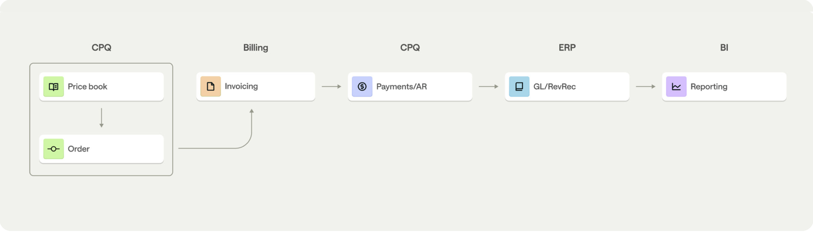
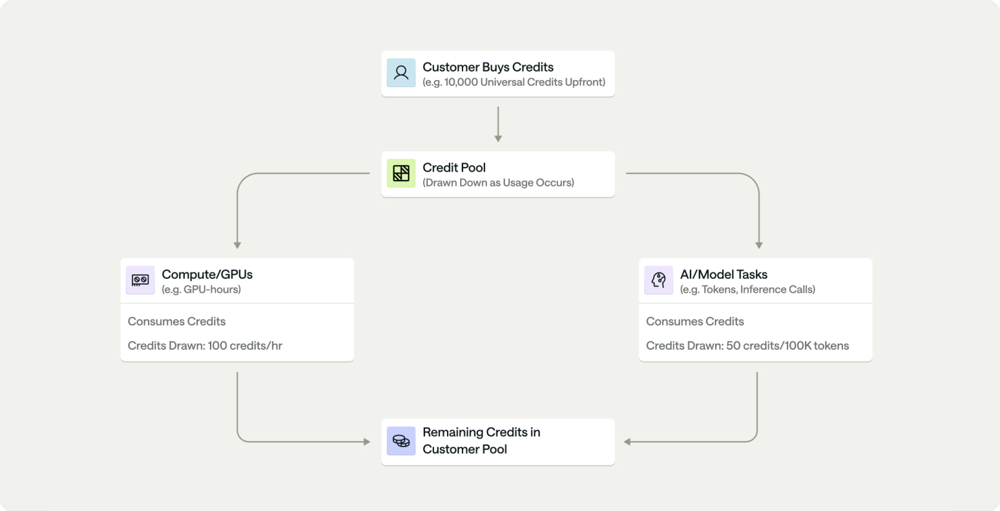
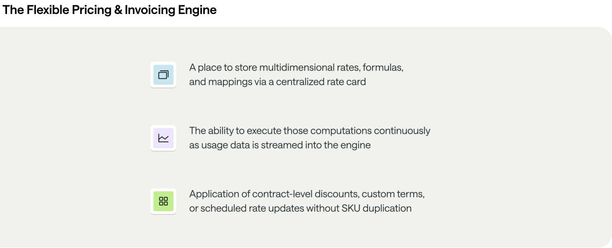
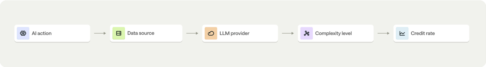
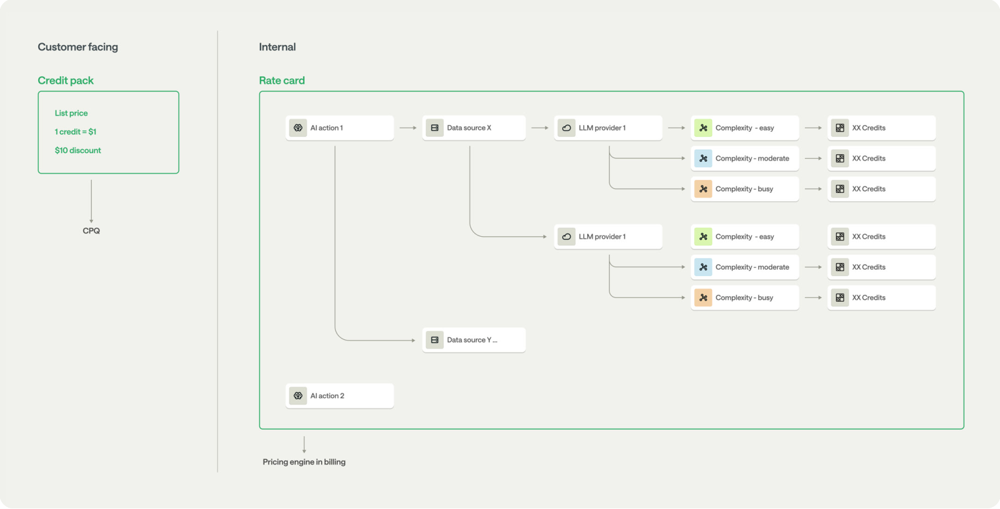
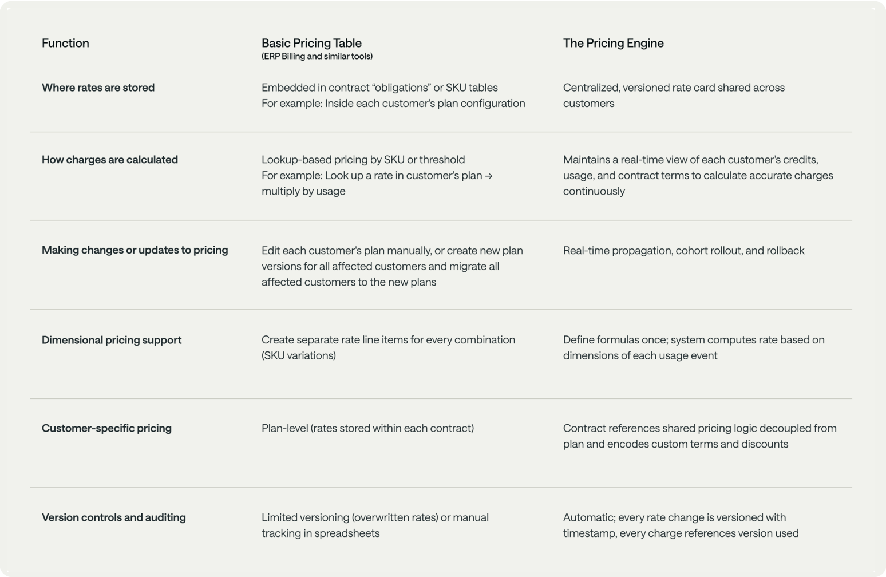
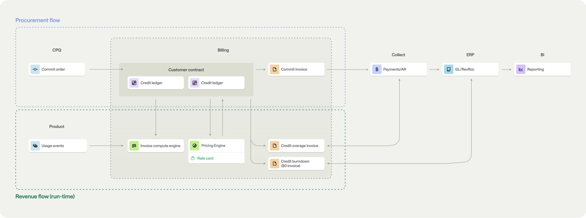

# Billing as the Operating System for Revenue

> Source: https://metronome.com/whitepaper/billing-as-the-operating-system-for-revenue  
> Author/Organization: Metronome  
> Whitepaper: The Next Evolution of Software

## Introduction

### In the AI era, feature velocity has made static pricing systems obsolete

As outlined in Metronome's Monetization Operating Model whitepaper, businesses have entered into a new era in product delivery, where AI and cloud technologies are changing how products are built, deployed, used, and valued by end-users. This has resulted in continuous delivery of new features, and the impact is more measurable than ever before. A document summarization tool adds image generation. A coding assistant accelerates integrations with new dev environments. An analytics platform adds real-time inference. Each of these features delivers unique value to each user, they each consume different amounts of resources, and each has different costs associated to run.

Yet the infrastructure most companies use to price and bill their customers for these features was built for a past era. Then, software shipped quarterly, or even annually. At best, a company's pricing would update annually, and a "seat" subscription meant the same thing for every customer.

But now, this mismatch is creating operational breakdowns:

- Finance teams manually fix invoices when LLM or compute costs increase mid-cycle and pricing needs to adjust.
- Sales operations manage 50+ SKU variations to represent core products, with a few AI features or services spread across different regions and packaged tiers.
- Product teams wait weeks for CPQ updates before they can test pricing or monetize new capabilities.
- Customers wait for usage dashboards that don't reflect real-time consumption, eroding their trust in billing transparency.

This isn't a process problem, though. It's actually an architectural problem. The system that manages pricing (CPQ) and records revenue (ERP) was designed when procurement equaled revenue, and when signing a contract meant delivering consistent, predetermined, and agreed-upon value over a fixed term. AI and usage-based products have broken that model.

### AI ecosystems have accelerated the shift to value-based pricing

Value-based pricing isn't new. A core principle of software pricing has been to align prices with value received by customers. But for years, the underlying technology of pricing tools wasn't sophisticated enough to execute on the granular details that unlock true value-based pricing.

The constraint was architectural: configure, price, quote (CPQ) store pricing in static SKUs or product catalogs. Once a deal is booked, the price (and assumed value) is locked. If a customer uses more features, consumes more resources, or receives better outputs (resulting in more value received), the vendor can't simply adjust the customer's pricing to capture the increased value that was delivered. Doing so would require contract amendments or manual intervention.

The AI era has forced a change in how companies monetize by making value both more visible and more variable.

- More visible value: Usage data shows exactly how (and how much) customers consume. For AI, usage comes down to which models customers use, what outputs they generate, and which tasks they automate. Companies can now measure value delivery event by event, not just through ROI estimates at contract signing.
- More variable value: The value customers receive when using AI models can vary wildly. For example, a 10-word summary costs less to generate and delivers less value than analysis of a 500-word financial report, even though both use the same fundamental capability. Because AI is still an emerging technology, underlying costs to deliver are already high, and will continue to shift. This means a vendor's pricing must be adaptable to model providers changing their prices as new features or models launch, ensuring the vendor maintains consistent customer experiences and margins.

With value being both more visible and variable, what's needed now is pricing infrastructure that can compute charges dynamically based on what has actually happened, not what was estimated to happen and was agreed to up front. The trouble is, traditional CPQ and enterprise resource planning (ERP) systems can't do this. They were built for the opposite model: define price at sale, recognize revenue evenly over the contract term, adjust as needed through formal amendments, and maintain structure and linearity.

## Legacy platforms can't keep pace

When the limitations of CPQ became apparent, many companies adopted usage-based billing solutions: accounts receivable (AR) automation platforms and ERP billing modules that claim to handle consumption pricing.

But these tools apply CPQ's architecture to usage billing's computational problem, creating a fundamental mismatch that makes this pairing inherently suboptimal. They can ingest usage data and generate invoices on schedules, but they have fundamental flaws:

- Rates are stored in plan-level configurations, so there is no centralization across customers.
- Usage is processed in batch jobs, so there is no real-time computation.
- Manual intervention is required for mid-cycle pricing changes, so there is no automated reconciliation.
- Granular invoice breakdowns are not possible, so there is no event-level or line-item-level transparency.

The result: Companies are stretching legacy architectures with custom code and manual workarounds, increasing maintenance workloads and requiring more resources. Finance asks IT or engineering to build Python scripts to reconcile invoices. Engineering must maintain internal billing systems, encoding more and more as new customer contracts roll in. Operations teams spend hours manually updating rates across customer contracts. In this world, every new AI feature adds operational overhead and drag instead of revenue.

For usage-native businesses and AI-native startups, this is a scaling problem they cannot ignore. In this new era, new feature ideas or customer requirements rely on rapid iteration and deployment of new value-added features to remain competitive. To capture new users and validate new feature ideas, free or self-serve models are becoming the norm. Without infrastructure that can handle the conversion of self-serve to paid customers through dimensional, dynamic pricing, these startups won't be able to meet customers where they are and, ultimately, monetize their products effectively.

## The solution: Billing must become a runtime system

Modern monetization requires billing to evolve from a record-keeper into a runtime system that continuously computes pricing, invoicing, and revenue as products, costs, and customer behavior evolve.

This is powered by two engines working in tandem:

- The pricing engine translates multidimensional product usage into prices using a centralized, versioned rate card. For example: storing rates like "GPT-4 inference in US-East = $0.03 per 1K tokens" and applying them consistently across all customers while allowing contract-specific overrides.
- The invoice-compute engine continuously aggregates usage, applies contract logic (credits, commits, overages) to rate the usage, and produces invoice-ready data in real time, not in overnight batches, but continuously as usage events occur.

The impact: Companies using this infrastructure can launch new AI features without CPQ changes, adjust pricing based on model costs without contract amendments, and provide customers with real-time usage visibility, all while maintaining clean financial records for revenue recognition.

Runtime system: The execution layer that continuously processes the logic required to convert customer activity into revenue. This system ingests usage events, applies pricing and entitlement rules, executes rating and metering workflows, and produces accurate charges in real time, while ensuring that all billing operations run reliably, consistently, and at scale as customers consume a product.

### What this paper covers

1. Why legacy systems fail: The architectural gaps in CPQ, AR automation, and ERP that prevent them from handling dimensional, dynamic pricing.
2. What modern infrastructure requires: The capabilities that define computational billing (pricing engines, invoice-compute engines, contract encoding for bespoke agreements).
3. How leading companies are adapting: A new monetization architecture where billing sits at the center of procurement and revenue flows.
4. Your path forward: How to audit your current system, identify gaps, and build a migration strategy.

The shift from static pricing to computational billing is already happening. AI-native and usage-native businesses are building on this foundation from day one. The question now is whether your organization makes this transition deliberately or waits until legacy systems break under operational load.

## The evolution of CPQ and ERP

For the past two decades, monetization followed a predictable flow. CPQ defined pricing and deal terms. ERP handled invoicing and revenue recognition. Everything between those two systems was static: a quote, a SKU, a schedule. Procurement equaled revenue. Once a deal was booked, finance amortized it evenly over the term.

That model worked when software was sold in fixed seats or tiers, products changed slowly, and pricing updates were infrequent. When selling access to software, there are limited opportunities to capture more revenue outside of new product launches, which would typically happen only a couple times per year.

Figure 1.0: Traditional procurement flow.

The emergence of AI and usage-based products have fundamentally changed this pattern. New features launch much more frequently, each packed with different value and cost structures. Because of the potentially high operating costs of launching new features, pricing teams must evaluate monetization and value delivered feature by feature while still rolling everything into a coherent customer-facing model.

One example is a universal credit framework, where users or enterprises purchase credits anchored on specific product metrics, then draw those credits down across predefined products and consumption metrics. This pricing structure can be highly beneficial because it lowers the barrier to adoption and enables either an accelerated product-led customer acquisition model or low-touch, high-velocity acquisition models where contract amendments aren't necessary, and in some cases can be prohibitive through increased friction, negotiations, and time to revenue.

To manage the shift to agile and diversified go-to-market motions and to support new customer buying preferences, pricing can no longer live in a static system. Invoicing can no longer be a passive accounting task. Billing can no longer be a transactional record keeper; it must now be the runtime system for modern pricing and revenue workflows.

In Figure 2.0, credits are shown as a standardized billing unit used instead of direct dollars, making it easier to abstract complex metering (e.g., GPU time, API calls, tokens) into a single currency. Customers prepay a block of credits that acts like a flexible spending account for consuming services. Different activities consume credits at different rates based on resource intensity (e.g., GPU hours cost more credits than a simple inference call). As services are used, credits are drawn down from the central pool until they run out or expire at period end.

Figure 2.0: Universal Credit Framework.

## Why pricing needs its own system

CPQ continues to serve an essential role in defining what is sold and under what terms. It governs quoting accuracy, approval workflows, and deal structure. However, modern pricing models have introduced two structural shifts that extend beyond CPQ's design: multidimensional pricing and credit-based monetization. These shifts require a computational layer inside the billing system to accurately and efficiently execute pricing logic in production.

### 1. Multidimensional pricing logic

Traditional CPQ implementations assume a single primary metric, such as seats or licenses, with optional add-ons or volume tiers. This structure works when every customer expects to receive value in roughly the same way.

Modern monetization models break that assumption. AI and usage-based pricing introduce multiple concurrent metrics such as API calls, GPU hours, inference tokens, or storage volume, each with distinct rates and aggregation rules.

Even SaaS companies that once relied entirely on seat-based pricing are now introducing AI-powered features like document summarization, image generation, or code completion. Each of these actions produces a different type of output, delivers a different level of value, and incurs different underlying LLM or API costs.

As a result, pricing cannot be expressed by a single metric or static SKU. It must reflect multiple dimensions: usage type, output complexity, region, and model cost, all of which change over time.

CPQ cannot represent this structure effectively, and in practice, creates three structural challenges:

SKU proliferation: If managed through a static system, each new metric or AI feature would require its own SKU or SKU variant, creating significant governance overhead for operations teams. For example: A product with 2 usage types, 3 output tiers, 3 regions, and 2 model options could need 36 SKU variations to represent all combinations, and that's before accounting for volume tiers or promotional pricing.

Version control and rate changes: Adjusting GPU-based inference cost while keeping AI summarization cost constant would result in multiple SKU versions or bundled variants. Managing these variations quickly becomes a version control challenge.

Encoding conditional pricing logic: Modern pricing requires flexibility, and CPQ's static nature lacks the mechanism to express multiattribute usage rules, resulting in each new conditional rule being represented with a new SKU variant.

The operational burden for consumption and usage-based pricing models must shift to the billing system. With a flexible pricing and invoicing engine within the billing stack, monetization and billing teams unlock an elegant path to fill the gaps listed above.

Figure: The Flexible Pricing & Invoicing Engine.

### 2. Credit-based monetization

The second structural shift in modern pricing is the adoption of credit-based monetization. Instead of charging customers separately for each feature or usage metric they consume, with every API call, document processed, or hour of compute having its own line item on the invoice, companies are now anchoring on a single unit of value. This lets companies sell prepaid credit packages that customers draw down from as they use various capabilities over time.

This model introduces both flexibility for customers to realize more value, as well as more cost and revenue predictability for finance teams. Still, it changes how systems have to run pricing and revenue processes. In credit-based models, procurement and revenue recognition are treated as separate processes.

- In CPQ, the sale represents the procurement event, for example, a $50,000 purchase of prepaid credits.
- In billing, revenue is recognized only when those credits are consumed, based on the type of usage that triggered each credit use.

Credits function as a common currency that can be applied across multiple products or features, each of which can have different cost structures and value profiles.

For AI-native and AI-assisted SaaS companies, this model has become the default.

- At the AI infrastructure layer, credits may represent computational resources such as tokens, GPU minutes, or API calls.
- At the AI application layer, credits might represent AI actions such as document summarization, insight generation, or code assistance, each drawing down credits at a different rate depending on output length, complexity, or model choice.

CPQ records the upfront sale of the credit pack but cannot compute how those credits are used or recognized as revenue once the customer begins using the product.

In contrast, a pricing engine within billing manages that logic by:

- Defining how each feature, usage type, or AI action converts into credit units.

Example: "one summarization = two credits" or "1,000 tokens = one credit."

- Continuously tracking credit consumption as usage occurs, updating credit balances and ledgers in real time, not in overnight batch processes.

Example: A runtime system that executes the credit use continuously as usage data arrives, updating credit balances dashboards and ledgers in real time.

Emerging benefit: Automatically "topping up" customer credit balances. Frictionless credit additions maintain the current adoption rate, generating more revenue during the user's session, or provide an opportunity to upgrade to a more expensive package. This tactic is particularly beneficial for intensive vibe-coding tools and similar agentic functions where there is a continuous human-in-the-loop experience.

- Mapping each credit use event to its contract, feature, and product for accurate revenue recognition.
- Applying contract-specific rules such as rollover, expiration, or bonus credits automatically.

By decoupling procurement from revenue, companies gain control over both dimensions of monetization:

- Sales operations retain clarity and simplicity in CPQ with standardized credit SKUs and quoting workflows.
- Finance and product gain precision in billing, with granular tracking of how each usage event converts into value and revenue.
- Product adoption becomes easier, with credits working equally well for self-serve and sales-led go-to-market motions and unifying experiences for both paths, enabling customers to iterate and experiment with new capabilities by simply drawing down from their existing credit balance.

### Real-world example: Credit-based AI pricing in practice

Let's say that customers buy a credit pack (for example, 1 credit = $1, 10% discount), and each AI action burns credits based on its underlying data source, model, and task complexity.

Inside the internal rate card, the pricing engine maps these dimensions.

Inside the rate card, the pricing engine stores how credits map to actual usage. For example: "When a customer uses document summarization (AI action), pulling from their CRM data (data source), using GPT-4 (LLM provider), generating a complex 500-word summary (complexity level), burn 5 credits (credit rate)."

Figure 3.0.

When an LLM provider lowers token costs, the pricing team updates that associated node in the rate card. The pricing engine recalculates credit consumption in real time: no CPQ SKU cloning, no contract edits, no billing rework needed.

This separation of customer-facing simplicity (credits) from internal dimensional pricing logic (rate card) is what turns billing into a runtime pricing system.

## Downstream platforms are not runtime systems

Downstream revenue platforms, including AR automation solutions and some billing modules within ERP platforms, now offer basic pricing tables and batch invoicing to support usage-based monetization. But these are narrow tools, not runtime systems. They can store rates and trigger invoice workflows, yet they cannot compute or orchestrate pricing and invoicing as live, continuous processes.

Without continuous compute and orchestration capabilities, these platforms and tools require additional workarounds to manage the complexity that comes with usage-based pricing models. They are good for recording what happened, but they're not purpose-built for handling continuous change and real-time data visibility.

This gap breaks down to two architectural capabilities that traditional billing systems lack:

1. A true pricing engine: A system that computes charges dynamically based on multiple dimensions, and doesn't just look up static rates.
2. An invoice-compute engine: A system that continuously calculates billing state in real time, not in scheduled batch jobs.

Let's examine why these capabilities matter, and what happens without them.

### 1. The pricing engine

Traditional AR automation solutions and downstream ERP systems still follow CPQ-style pricing structures, which means each plan or customer configuration defines its own rates. For example, when you set up billing for a customer in most AR automation or ERP systems, you create a "plan" or "pricing configuration" specifically for that customer. Inside that plan, you specify their rates.

These rates live inside that specific customer's configuration. Some systems call these "line items," others call them "obligations," but the concept is the same: each customer's pricing is stored separately within their own contract or plan record.

When usage data arrives, the system:

1. Looks up which plan this customer is on.
2. Finds the rate for the specific usage type.
3. Multiplies usage x rate = charge.
4. Adds a line item to the invoice.

### Why this breaks down with modern usage-based pricing

Problem 1: No single source of truth.

In absence of a centralized location for pricing and rates, even basic pricing questions become research projects. If your CFO asks:

- "What's our average price per API call for enterprise customers?"
- "If we reduce GPU pricing 15%, what's the revenue impact?"
- "Are we pricing consistently across similar customers?"

You can't answer directly. You must export data from customer plans, manually aggregate rates in spreadsheets, and reconstruct pricing logic that may live in multiple places. What should take minutes takes days.

The root cause: rates live inside each customer's configuration rather than in a centralized, queryable rate card.

Problem 2: Changes require adjustments for each customer.

When an LLM lowers their costs by 20% and you want to pass savings to customers, your team either manually updates each customer's plan, creates new plan versions, and migrates customers to the new plans, or issues credit memos after invoices go out.

There's no functionality that allows you to update the rate once and have it apply correctly to all customers.

Problem 3: Dimensional pricing requires SKU explosion.

If your pricing depends on multiple factors, usage type, region, model tier, output complexity, you need separate rate configurations for every combination. For products with different usage types, rates, and tiers, you have to create different rate configurations for each customer.

Because AR automation and ERP-based solutions are associated with billing, many vendors will naturally claim an ability to support usage-based billing. Many use the same constructs as traditional systems: items or obligations embedded within each contract to represent pricing. These solutions can store usage thresholds or apply basic per-unit charges, but architecturally, they behave more like singularly focused invoice generation and accounts receivable tools.

What they lack is a centralized, versioned rate card capable of mapping and executing dimensional pricing logic across the customer base at scale and in real time.

### What a pricing engine does differently

A pricing engine uses a centralized rate card that stores pricing as formulas and relationships. This is the core distinction: a pricing table stores static values; a pricing engine computes relationships dynamically.

### Why this matters operationally

When a LLM provider lowers costs, you make your corresponding updates in the rate card once. The system automatically does the following for all customers, simultaneously:

- Applies the new rate to all future usage, starting from the change date.
- Preserves the old rate for usage that occurred before the change.
- Maintains a complete audit trail of which rate applied when.

No manual plan updates. No credit memos. No spreadsheet tracking of who got which rate at what time.

Figure 4.0: The comparison.

### 2. The invoice-compute engine

Downstream ERP platforms have advanced considerably over the years. Many now claim to support real-time usage ingestion, faster invoice generation, and alerting on billing performance. These capabilities no doubt improve workflow automation, but they still fall short of runtime-level computation.

A modern invoice-compute engine does more than automate invoicing workflows. It continuously computes customer billing states as usage, pricing, alert threshold, and contract data evolve. It applies the correct pricing version, credit logic, and discount rules to every usage event, synchronizing results instantly with invoices, ledgers, customer dashboard, and revenue recognition.

In contrast, AR automation tools and ERP platforms rely on configuration-driven workflows. They can pull usage data, apply simple aggregation logic, and trigger invoices or alerts when thresholds are met, but these are scheduled processes, not continuous computation engines.

Their architecture reveals critical gaps for usage-based billing:

- Latency is neither guaranteed nor proven under volume surges. When a customer generates millions of usage events in a billing cycle, common with AI inference workloads or API-heavy products, these systems often process usage in overnight batch jobs, thus creating delays and data bottlenecks.
- Mid-cycle changes require manual intervention. When rates or credit details change during an active billing period, finance teams must reprocess invoices manually or issue credit memos to correct errors. The system cannot automatically recompute affected usage because pricing logic is embedded in each plan configuration, not executed by a versioned engine.
- Credit and prepaid balance management lacks real-time accuracy. AR automation tools typically track prepaid balances as static ledger entries, updated periodically rather than with each usage event. This means customers cannot see live credit burns or accurate remaining balances.
- Invoice breakdown and drill-downs require post-processing. Customers asking about a specific charge cannot get granular, event-level explanations, requiring finance teams to export data to spreadsheets or business intelligence (BI) tools to reconstruct the calculation path from usage to charge.

The impact naturally extends to customer experience. Exposing real-time usage and billing data through APIs or dashboards requires live computation, not post-processed aggregates. Without a runtime invoice-compute engine, customers see delays, inconsistent balances, or stale usage metrics, eroding trust and the solution's value.

### Why the difference matters

When a LLM provider lowers their pricing and you want to pass those savings on to customers mid-billing-cycle, the configuration approach requires you to manually edit hundreds of customer plans or issue credit memos after invoices are sent. The computational approach updates the rate card once, and the system automatically applies the new rate to subsequent usage while maintaining the old rate for prior usage, with full auditability of which rate applied when.

A modern invoice-compute engine enables:

- Continuous invoicing: Usage data is rated, aggregated, and billed in real time as events occur.
- Version-aware computation: Invoices always reflect the pricing logic active at the time of usage.
- Automated reconciliation: Event updates or backdated usage automatically flow through to invoices, ledgers, and revenue recognition, keeping all systems synchronized without manual intervention.
- Customer visibility: APIs and dashboards show live billing data directly from the runtime pipeline.

## The new architecture of monetization

In the modern technology stack, billing sits at the center of both procurement and revenue flows. Upstream, CPQ and contracting systems define commercial intent, specifying what the customer buys and at what commit level. Downstream, ERP and BI systems record financial outcomes.

Between these layers, billing operates as the runtime system, powered by the pricing engine and the invoice-compute engine.

This structure unlocks several impactful capabilities:

- The pricing engine translates product activity into value and pricing through a centralized, versioned rate card.
- The invoice-compute engine continuously aggregates rated usage, applies contract and credit logic, and produces invoice-ready data in real time.
- A contract encoding layer sits above the runtime system to translate each customer's unique deal terms, things like prepaid balances, commit minimums, expiration rules, discount schedules, into structured data that the pricing and invoice engines can reference automatically.
- The pricing engine continuously references the runtime system to ensure credit usage accuracy, usage tracking, and revenue recognition.

This architectural approach unifies procurement and revenue into a single operational flow. Finance, product, operations and GTM teams all work from the same live data, where every usage event, price change, or contract update propagates instantly through billing, invoicing, collections, and reporting.

The example in Figure 1.0 extends across this entire architecture. The following diagram illustrates how usage events from the product flow through the pricing engine and invoice-compute engine, updating credit ledgers, invoices, and revenue systems in real time. It shows the full path of value creation, from a customer's prepaid commitment to recognized revenue.

Figure 5.0.

## Modern monetization powered by a runtime system

Modern monetization extends billing beyond static record tracking. When billing operates as a runtime system, it elegantly and automatically powers new capabilities. No more of the heavy, constant configuration that's required when using platforms or legacy tools.

This shift enables four foundational use cases that define the modern monetization stack.

### 1. Dimensional and granular pricing

Modern monetization operates on different principles that require a new foundation. Instead of singular, seat-based plans, pricing now depends on a myriad of factors that more closely reflect how value is created and realized by end-users.

The rate card model helps replace flat pricing structures, defining all pricing dimensions in one unified system, including usage type, AI feature, task, model, input source, output complexity, and region. Each dimension has its own rate and aggregation rule. The pricing engine centrally defines these dimensional prices, while the invoice-compute engine applies the correct rates to billing, credit ledgers, and invoices as usage data streams in real time.

For example, an AI product may process a mix of document summarizations, insight queries, and inference calls, each producing different outputs and incurring different underlying model or API costs. The rate card captures this variability, calculating pricing for each action while maintaining a single, coherent price presentation to the customer and providing the transparency and cost predictability they need.

The shift from per-plan configuration to a dynamic rate card allows billing to maintain pricing flexibility. With more flexibility, monetization teams can more easily iterate and experiment on the most optimal model, metrics, and price points, a requirement to ensure that pricing evolves as new features or cost structures are introduced.

### 2. Prepaid and credit-based monetization

Many companies now sell prepaid credits as a universal currency across products. Credits simplify procurement while allowing flexible, feature-level usage.

The pricing engine defines how product usage converts to credits through conversion ratios and rates. The invoice-compute engine executes credit burns in real time and maintains accurate ledgers for finance.

Maintaining both in a runtime system also supports different pricing tiers or rates for each feature while keeping the customer experience unified under one balance. This structure separates the timing of procurement from revenue recognition: sales books the contract; finance records consideration as a contract liability (deferred revenue) as appropriate, and revenue is generally recognized as credits are consumed.

### 3. Continuous pricing evolution

Pricing evolves as products, costs, and customer needs change. Teams often introduce new features or adjust rates to reflect updated AI capabilities or underlying model costs. These changes should not require contract amendments or CPQ updates for customers to benefit from them.

The pricing engine allows these changes to be implemented directly in billing. It allows teams to modify pricing logic in production while keeping existing contracts intact.

The invoice-compute engine ensures the right logic applies to the correct customers, features, and billing periods without migrations or reprovisioning. It also provides control over how and where pricing changes take effect. Cohort-based functionality allows teams to:

- roll out new pricing to a limited pilot group,
- apply changes only to new customers, or
- target specific customer segments or regions.

This controlled rollout ensures that new pricing can be tested, validated, and expanded safely without touching CPQ or creating new SKUs, unless a completely new packaging or offering is being introduced.

Versioning, rollback, and time-based scheduling keep every change traceable and auditable, giving finance, RevOps, and product teams a shared source of truth for both current and historical pricing.

### 4. Cross-system orchestration

Traditionally, introducing or changing a SKU requires broad coordination. RevOps validates pricing tables in CPQ, finance tests ERP mappings, engineering checks metering compatibility, and teams manually edit customer contracts. Each step needs fallback testing to avoid breaking invoicing or revenue recognition. Doing this for every new AI feature or a price reduction driven by LLM cost is clearly not scalable.

The modern monetization system eliminates this overhead. The pricing engine serves as the single configuration source for all rates and rules. The invoice-compute engine propagates updates automatically to metering, billing, ledgers, and revenue recognition.

Together, they enable the following:

- The rate card as the authoritative configuration; changes are made once and versioned.
- Updated pricing logic pushed to metering and rating instantly, so event mapping and rate application are consistent.
- Credit burn and balance updates computed in real time, then results are written to billing and ledgers.
- Invoice and spend data exported to finance systems so revenue recognition reflects the new rules without manual rework.

Operational controls keep this safe in production:

- Cohorts and schedules limit the impact of pricing changes. Teams can pilot changes, restrict to new customers, or roll out by segment or region.
- Validation gates catch errors early. The engine runs schema and compatibility checks before activation and rejects invalid mappings.
- Rollback is immediate. Prior versions remain available, so teams can revert without touching CPQ or editing contracts.
- Auditing is clear and complete. Every change is recorded with who, what, when, and where it applied, and downstream invoices and revenue recognition entries reference the correct version.

This design replaces manual workflows with governed runtime computation so changes are made once in the source of truth and executed automatically across the financial stack.

## Conclusion: From configuration to pricing engine

As products continuously evolve, and new products and features are rapidly launched, so must the infrastructure that translates usage into revenue. Modern billing is no longer a passive system of record. Companies processing billions of usage events monthly cannot wait weeks for CPQ updates or manually reconcile invoices when model costs change. The pricing engine and invoice-compute engine together form the foundation of this new model, turning every product event into financial truth.

AI-native companies building on modern billing infrastructure from day one can experiment with pricing models, launch features faster, and provide superior transparency to customers. Companies stuck in legacy architectures face a compounding disadvantage: every new feature adds operational overhead, every pricing change requires cross-functional coordination, and every growth milestone exposes new breaking points. The question isn't whether billing becomes computational, but whether your organization makes this transition deliberately or is forced into it by operational bottlenecks.

The litmus test is simple: Can you launch a new AI feature tomorrow with dimensional pricing (charged by tokens, model, region, and complexity) without touching CPQ, without creating new SKUs, and without manual invoice adjustments? If not, you're running monetization on legacy architecture and can expect to continue to face a series of increasingly difficult monetization challenges as you try to continue scaling with your current setup.

## What this means for different teams

For finance leaders: Modern monetization infrastructure doesn't just improve accuracy; it provides the control and auditability that finance demands. Every pricing change is versioned, every revenue impact is traced to specific usage events, and every invoice can be reconstructed from first principles. This is governance at the computational level, not just better documentation.

For RevOps and sales: The credit-based model removes friction in the deal cycle. Instead of negotiating rates for multiple different features, you can sell standardized credit packs while the billing system handles dimensional pricing internally. Your team closes deals faster, customers get flexibility, and finance gets clean revenue recognition.

For product teams: When billing operates as a runtime system, you can iterate on monetization as fast as you iterate on features. Test new pricing in production with cohort rollouts. Adjust rates based on actual cost data without waiting for quarterly CPQ updates. Make pricing a lever for product strategy, not a constraint.

### Three actions to take

1. Audit your pricing complexity.

Map every dimension that affects how you charge customers: usage type, feature tier, output quality, model choice, region, seasonality, etc. If you're representing this through CPQ SKUs, count how many variants exist. If you're over 50 SKUs, or creating 10+ new ones per quarter, you've likely outgrown configuration-based systems.

2. Identify your computational gaps.

Not all "usage-based billing" systems are runtime engines. Many AR automation platforms and ERP modules offer usage tables and scheduled invoicing but lack true pricing engines or invoice-compute engines.

3. Build your migration strategy.

The transition to computational billing doesn't happen overnight, but it also doesn't require ripping out your entire stack. Modern monetization platforms integrate with existing CPQ and ERP systems, becoming the computational layer between them.
