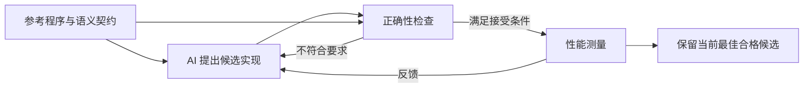

# 阅读笔记

> 来源：[Compilers 2.0: AI as stochastic optimizer](https://x.com/i/article/2094865284024991744)。正文经公开接口读取，具体方式见[元信息](meta.json)。
>
> 以下主要是阅读者自己的解释、例子与待验证问题，不是作者公布的内部实现。

## 先抓住信任边界

“我没有逐行理解输出”与“没有人需要为输出的正确性负责”是两回事。使用编译器时，我们也经常不检查全部汇编，但这份信任仍有来源：语言语义、工具链实现、测试、验证及实际运行经验。

据此理解本文，最有价值的问题是：生成器能提出多大胆的改写，而接收结果的机制能提供多强的证据？两者可以分别进步。生成器不必拥有完美判断力，但错误候选应当被挡在采用之前。

下面是帮助理解的概念流程，不是已披露的系统架构图：



注意，图中的“正确性检查”没有预设为形式化证明；它的强度正是需要查明的部分。

## 用一个浮点例子理解契约

下面的例子由阅读者构造，与 MLA 内核的具体实现无关。

数学实数满足结合律，但浮点运算存在舍入。取双精度浮点值：

```python
a = 1e16
b = -1e16
c = 1.0

print((a + b) + c)  # 1.0
print(a + (b + c))  # 0.0
```

如果优化器为了提高并行度改变求和顺序，“公式看起来一样”并不能直接证明输出逐位一致。必须先定义允许的行为：

| 契约要求 | 对候选实现的判断意味着什么 |
|---|---|
| 输出逐位一致 | 改变求和顺序可能不合格 |
| 在规定绝对／相对误差内 | 需要明确误差度量、输入范围以及零值等特殊情况 |
| 只在特定 shape、dtype 上工作 | 不能自动推广到其他形状或精度 |
| 包含内存与并发行为约束 | 只比较最终数值不足以检查越界访问或竞态 |

所以“强契约”并非一句“实现这个算子”，而是足够准确地描述允许哪些输入、输出与副作用。参考程序也需要满足这份契约。

## 三种判断不能混在一起

| 判断 | 可以提供的证据 | 不能由此自动推出 |
|---|---|---|
| 候选在测试集上通过 | 这些案例没有暴露差异 | 所有合法输入均正确 |
| 候选在明确模型下通过等价证明 | 在证明覆盖的语义和假设下等价 | 证明模型外的硬件、运行时和输入也都正确 |
| 候选在基准上更快 | 给定负载和测量环境下性能改善 | 全部部署环境都更快，或全局最优 |

文章没有公开足够细节，让读者把团队的检查机制明确归入第二行。应保留这个未知，而不是从“编译器”这个类比中推导出保证。

## STOKE 带来的背景与边界

文章引用的 [STOKE 论文](https://theory.stanford.edu/~aiken/publications/papers/asplos13.pdf) 将无循环二进制程序的超优化写成随机搜索问题，用 MCMC 探索候选。论文描述了先通过测试筛选有希望的程序，再送入验证引擎证明或反驳正确性的安排。这说明“候选搜索”和“候选验证”分工并非始于 LLM。

它的摘要也明确说方法牺牲了完备性。因此，阅读随机游走或无限时间下的理论讨论时，不能把它改写成“有限预算下保证找到全局最优”。这段补充依据原始论文，而不是将 X 文章中的概括当成完整定理。

## 什么情况下投入搜索可能划算

以下是阅读者建立的粗略成本模型，不是原文公式。

若一次优化花费 $C$，单次执行节约价值为 $s$，之后执行 $N$ 次，则先看：

$$
N\times s>C.
$$

各项需要统一为同一种成本单位。这个简单模型还没有计入验证、维护、硬件迁移及性能回归成本。它解释了为什么反复运行的热点内核，与只执行几次的普通脚本，可能值得分配完全不同的优化预算。

同时，需要保存当前最佳合格结果。随机优化下一轮可能更差，不应因为它是“最新生成的”就覆盖已经验证的版本。

## 与前两篇阅读的联系

- [SubmitQueue](../2025-01-07-ci-at-scale-lean-green-and-fast/index.md) 利用预测安排计算，但合入仍受验证条件约束。这里同样值得把“用学习方法提高效率”与“接受结果的依据”分开。
- [Specula](../2026-08-12-specula-scaling-formal-specifications/index.md) 引出规格从哪里来的问题。即使候选完美符合参考程序，如果参考程序本身表达错了需求，等价性也不会修正那个需求错误。

这两点是跨文章的阅读者归纳，不是三篇文章作者之间的相互背书。

## 后续最值得查明的问题

1. 所谓语义检查具体使用差分测试、符号验证、形式化证明，还是组合方法？覆盖哪些输入与执行行为？
2. 数值契约是逐位一致，还是允许误差？误差阈值由谁定义？
3. 候选是否固定在部分形状、布局或硬件上？如何防止只优化已知基准？
4. 性能收益是否能抵消搜索、验证和持续维护的总成本？
5. 如何保存代码、编译器、驱动和基准版本，使同一候选能够复查与复现？

## 我的想法

这条路线把人的工作重点进一步推向可检查的需求与可靠的接受机制。是否需要逐行读代码，取决于当前能获得多强的替代证据，而不是取决于代码是不是由 AI 生成。
