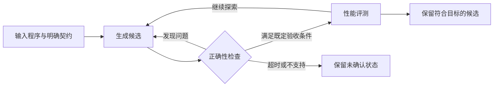

# 编译器 2.0：中文导读

> 原文：[Compilers 2.0: AI as stochastic optimizer](https://x.com/i/article/2094865284024991744)
>
> 作者：[@cdleary](https://x.com/cdleary)
>
> 发布：2026-09-01（UTC）；导读更新：2026-09-13。

本文件包含原文提要，以及结合研究资料编写的中文背景讲解，不是逐段全文翻译。术语解释和数学表达为辅助阅读而写；案例、质疑和讨论见[阅读笔记](notes.md)。

## 原文提要

作者把 AI 放在优化编译器的候选生成位置：人给出语义明确的高层描述，模型探索更高效的实现，检查机制负责确认语义一致。文章借超优化与性能专家的工作方式解释这种搜索，再用 MLA 内核说明 AI 在概念上承担生成和优化工作。作者据此类比传统编译器，解释为何不必逐行阅读生成代码。他表示团队已有一致性检查，但具体方法留待后续说明；本文不能据此被读作一份完整的正确性证明。[来源](https://x.com/i/article/2094865284024991744)

## 先把几个概念分开

以下是帮助阅读的通用概念解释。

| 概念 | 在本次阅读中的理解 |
| --- | --- |
| 程序语义 | 哪些输入与行为属于程序的约定，包括结果及需要观察的副作用 |
| 中间表示（IR） | 编译器用于分析和变换程序的内部表示 |
| 降低抽象层级（lowering） | 把较高层操作表达为较低层操作 |
| 优化（optimization） | 在满足正确性条件的候选中，改善一个明确的目标 |
| 程序合成（program synthesis） | 依据约束或规格寻找满足要求的程序 |
| 翻译验证（translation validation） | 针对一次具体转换，检查输入程序与输出程序的语义关系 |

“变得更低层”和“变得更快”可以是两个独立的变化。将一个矩阵操作展开成循环，说明表示形式发生了变化；它是否更快，还要看执行环境和测量目标。也可以在同一表示层级中改写程序，而不进行新的 lowering。

## 用一个关系表达“符合原来的含义”

下面的记号是自编的阅读辅助，不是原文公式。

设输入程序为 `F`，候选程序为 `G`，契约为 `C`。把契约允许的输入记为 `D_C`，把可接受的行为关系记为 `R_C`，则可以提出如下正确性目标：

```text
对每一个 x ∈ D_C：
    R_C(F(x), G(x)) 成立
```

如果契约要求精确相等，`R_C` 就可以是相等关系。如果允许一定数值误差，或者规定了不同的可观察行为，就要把这些要求写进关系。不能在看到结果有误差之后，才临时更换比较标准。

这也让“规格很数学化”变得更具体：除了给出计算式，还需要给出输入范围、数据类型、异常条件和可观察效果。清晰的公式有助于定义契约，但不能自动填补这些条件。

## 搜索程序：STOKE 提供的背景

STOKE 将无循环机器指令序列的优化建模为随机搜索，用包含正确性与性能因素的代价函数引导探索。论文描述了先用测试筛选候选，再把有希望的候选提交给验证引擎的分工。它明确指出这种搜索牺牲了完备性，以探索更大的程序空间。[STOKE 原始论文，摘要及第 1—3 节](https://theory.stanford.edu/~aiken/publications/papers/asplos13.pdf)

这个背景帮助我们分别讨论三个能力：提出候选、找出候选中的错误、比较通过检查的候选。一个组件善于提出新实现，不足以说明它也能可靠判断自己的实现是否满足所有条件。

下面是为理解这种分工绘制的概念流程，并非原文公布的系统实现：



## 验证程序：需要说明检查覆盖了什么

Alive2 是一个具体的翻译验证研究实例。它针对 LLVM IR 使用 SMT 求解器进行有界验证，例如限制循环展开次数；作者明确说明，这些边界意味着某些错误可能漏检。[Alive2 作者页面](https://web.ist.utl.pt/nuno.lopes/pubs.php?id=alive2-pldi21)

这个例子不是在推测文章团队使用了 Alive2，而是提醒我们：介绍一种验证方法时，应该同时介绍它的语义模型和覆盖范围。

若一个检查只枚举了十个输入，通过的结论只覆盖这十个输入。若一个符号检查覆盖某个指定输入域，它的结论要连同输入域和建模假设一起理解。若求解超时，没有发现反例也不能直接当作验证成功。

## 一个整数契约的小例子

假设任务是计算整数序列的平方和，并且契约明确采用无限精度整数算术：

```python
def sum_squares(xs):
    return sum(x * x for x in xs)
```

如果候选实现把乘法改成 64 位模运算，那么对于 `xs = [2**32]`，参考结果为 `2**64`，而模 `2**64` 的乘积为 `0`。表达式看起来仍然是平方和，算术语义却已经不同。

我们可以选择限制输入范围，或者明确允许某种机器整数语义，但这些选择会改变需要满足的契约。这个自编例子说明，验证前必须先回答“要求相等的究竟是哪一种行为”。

## 继续精读的顺序

读搜索部分时，关注候选空间与搜索预算；读正确性部分时，关注契约与覆盖范围；读性能部分时，关注基线和测量条件。三者分别对应“能想到什么”“能确认什么”和“改善了多少”。[阅读笔记](notes.md)继续讨论浮点重排、最优性和优化成本。
