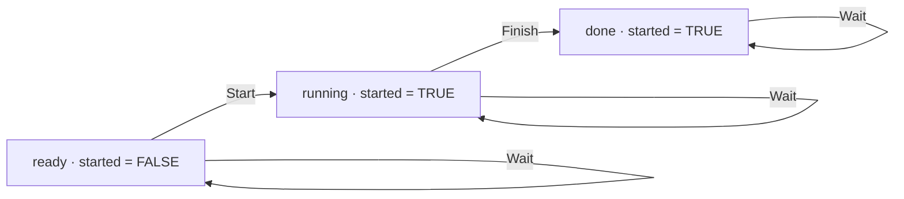

# 互联网发现了 TLA+，接下来呢？——中文导读

> 原文：[The internet discovers TLA+. Now what?](https://reasonable.io/blog/tla-tutorial/)
>
> Reasonable 团队，2026-09-25。作者与完整来源见[文章入口](index.md)。

本文件包含简要原文提要与有来源的概念讲解，非全文翻译。后半部分的工作任务模型为自编示例，实际运行结果已保存。

## 原文提要

文章从选主模型介绍安全性、活性与公平性，强调有限实例的模型检查不能自动保证真实实现正确，随后讨论把时序规格连接到 Verus 证明和实现精化的路线。团队报告从 16,459 个规格／性质对出发，得到 3,000 多份机器检查的证明，并构建了 40 项评测任务；本文主要是工作预告，未展开完整评估。这些结果不能直接理解为已经验证了同等数量的软件实现。[原文](https://reasonable.io/blog/tla-tutorial/)

## 先认清描述的对象

| 对象 | 阅读时的含义 | 自编工作任务中的对应项 |
| --- | --- | --- |
| 状态 | 某一时刻所有模型变量的取值 | `phase = "ready"`，`started = FALSE` |
| 动作 | 当前状态与下一状态之间的关系 | `Start` 将任务变为运行中 |
| 初始条件 | 哪些状态可以作为起点 | 一开始尚未启动 |
| 下一步关系 | 一步允许哪些变化 | 启动、完成或保持不变 |
| 行为 | 状态随时间形成的序列 | 就绪、运行、完成、完成…… |
| 不变量 | 每个可达状态都要满足的状态条件 | 完成时，必须已经启动过 |
| 活性条件 | 对行为最终进展的要求 | 任务最终到达完成状态 |

TLA+ 中的撇号表示下一状态的值；`UNCHANGED` 表示指定变量保持原值。`[][Next]_vars` 允许满足 `Next` 的步骤，也允许 `vars` 保持不变的停顿步。允许停顿与保证进展是不同的要求。[Lamport，《Specifying Systems》，第 2、8 章](https://lamport.azurewebsites.net/tla/book-21-07-04.pdf)

## 用一个小模型理解公式

完整模型见 [WorkerProgress.tla](examples/WorkerProgress.tla)。模型允许任务启动、完成或暂时不动；`AllowStart` 用于制造无法启动的情形。



图中只有三个从正常初始条件可达的状态。`AllowStart = FALSE` 时，启动边不存在，只有就绪状态可达。

三个公式分别规定允许的行为、附加的公平性和要检查的进展：

```tla
Spec == Init /\ [][Next]_vars
FairSpec == Spec /\ WF_vars(Start) /\ WF_vars(Finish)
EventuallyDone == <>(phase = "done")
```

第一行没有承诺什么时候启动或完成，所以一直停顿也是可能的行为。第二行对两个动作分别添加弱公平性。第三行要求最终出现完成状态，它是待检查的性质，不能仅因为写在文件里就认为成立。

弱公平性约束持续启用的动作不能永远被拖延；强公平性进一步约束无限次被启用的动作。精确定义针对会改变所选变量的动作步骤，不能把执行无效果的空转算成进展。[Lamport，第 8 章](https://lamport.azurewebsites.net/tla/book-21-07-04.pdf)

## 七组实际检查

本地使用 TLC `2026.03.19.000345`，结果保存在 [results.json](examples/results.json)。表里的“反例”均是实验有意安排的结果。

| 配置 | 检查内容 | 结果 |
| --- | --- | --- |
| `SafetyOnly.cfg` | 正常启动条件，仅检查状态类型与不得提前完成 | 通过，3 个不同状态 |
| `NoFairness.cfg` | 同一模型，增加最终完成要求 | 活性反例：启动后永久停顿 |
| `WeakFairness.cfg` | 对启动与完成分别要求弱公平性 | 通过，3 个不同状态 |
| `BlockedSafety.cfg` | 禁止启动，仍检查安全条件 | 通过，只有 1 个不同状态 |
| `BlockedProgress.cfg` | 禁止启动，并要求最终完成 | 活性反例：始终停在就绪状态 |
| `NotInductive.cfg` | 将所有满足 `Safety` 的状态都作为起点 | 不变量反例 |
| `Strengthened.cfg` | 改用更强条件约束起点并检查其保持性 | 通过 |

后两项改变了初始条件，用于讨论归纳证明，不能与正常任务的运行结果混为一谈。[阅读笔记](notes.md)解释了具体反例。

本实验显式包含 `Wait`，因此即使任务无法启动，也有保持原状态的后继。TLC 的死锁检查仍然开启；这里没有把无法完成任务简单等同于没有任何后继状态。

## 从模型走到实际代码

Verus 将代码区分为 `spec`、`proof` 和 `exec` 三种模式，分别用于描述性质、证明性质与执行程序；其项目说明也明确支持的是 Rust 的一个子集。把这些内容放在同一工具体系中，有助于表达它们之间的联系，但具体证明仍要检查覆盖范围。[Verus 模式说明](https://verus-lang.github.io/verus/guide/modes.html)、[项目说明](https://github.com/verus-lang/verus)

Anvil 提供了一个具体研究方向：为 Kubernetes 控制器定义并证明最终稳定协调等活性性质。它展示了围绕实际控制器构建证明框架的做法，而不是任意应用接入后都能自动得到同样保证。[Anvil](https://github.com/anvil-verifier/anvil)

回到自己的程序，可以依次追问：模型描述了什么，工具检查了什么，哪些运行环境假设被采用，以及代码中的每一步如何对应模型允许的变化。回答这四个问题，比单独看到一个“通过”结果更接近理解验证覆盖了什么。
