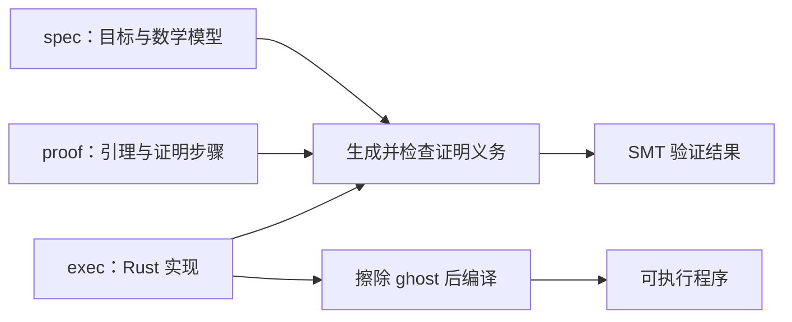

# Verus：把规格、证明和 Rust 实现写在一起

> 延伸研究：2026-09-27。承接 [TLA+ 阅读笔记](notes.md)。
>
> 本文依据 Verus 官方文档展开，三个程序为本次独立编写。已用 Verus `0.2026.09.20.aef82ed`、Rust `1.98.1` 在 Apple Silicon 上验证、编译和运行；[代码与复现方法](examples/verus/README.md)、[实际结果](examples/verus/results.json)。

文章说的“同一种语言”，可以具体理解为：在同一个 Rust 源文件里，用 Rust 风格的表达式、函数和数据类型，分别描述目标、提供证明、实现算法。Verus 通过 `verus!` 宏扩展语法，加入 `spec`、`proof`、`requires`、`ensures` 等验证构造，并对宏中的代码进行检查。[官方语法介绍](https://verus-lang.github.io/verus/guide/verus_macro_intro.html)

这些扩展需要 Verus 工具链处理。项目目前支持 Rust 的一个子集，现有 Rust 项目能否直接验证，还要看用到的语言特性与库规格。[Verus 项目说明](https://github.com/verus-lang/verus)

## 三种模式如何配合

| 模式 | 写什么 | 本次例子 | 生成程序时 |
| --- | --- | --- | --- |
| `spec fn` | 数学定义、状态条件、结果应该满足的关系 | 限幅的数学定义、序列前缀计数、配额的下一状态 | 擦除 |
| `proof fn` / `proof {}` | 引理、归纳步骤、帮助验证器连接事实 | 证明前缀计数不超过前缀长度 | 擦除 |
| 普通 `fn`，默认 `exec` | 分支、循环、读写 Rust 数据 | 遍历 `Vec`、修改配额字段 | 编译成可执行代码 |

`spec` 和 `proof` 统称 ghost code。执行函数可以在契约或证明块里引用它们；运行时的计算不能依赖一个已经被擦除的规格函数。`spec` 采用纯函数式数学表达，`proof` 可以组织证明步骤，`exec` 则受可执行 Rust 的类型和操作约束。[模式说明](https://verus-lang.github.io/verus/guide/modes.html)、[规格函数](https://verus-lang.github.io/verus/guide/spec_functions.html)、[ghost 与 exec 的边界](https://verus-lang.github.io/verus/guide/ghost_vs_exec.html)

同样写 `+`，也要看所处模式。规格里的 `int` 是无界数学整数；程序里的 `u64` 有上限。Verus 需要证明可执行加法不会溢出。规格中的常见算术运算会按数学语义扩宽结果，因此可以用它们表达“结果应当落在机器整数范围内”的条件。[整数与算术](https://verus-lang.github.io/verus/guide/integers.html)



这是理解工作流的示意图。下面的例子都同时运行验证和编译；一次普通 Rust 编译本身不代表完成了 Verus 验证。

## 例一：数值限幅，把三种模式放在一起

需求：给定 `lo <= hi`，把输入限制在 `[lo, hi]`。完整程序见 [clamp.rs](examples/verus/clamp.rs)。下面是其中的核心部分，可放进 `verus! { ... }`：

```rust
spec fn clamp_spec(x: int, lo: int, hi: int) -> int {
    if x < lo { lo } else if x > hi { hi } else { x }
}

proof fn lemma_clamp_bounds(x: int, lo: int, hi: int)
    requires lo <= hi,
    ensures lo <= clamp_spec(x, lo, hi) <= hi,
{
}

fn clamp_value(x: u32, lo: u32, hi: u32) -> (r: u32)
    requires lo <= hi,
    ensures
        r as int == clamp_spec(x as int, lo as int, hi as int),
        lo <= r <= hi,
{
    let r = if x < lo { lo } else if x > hi { hi } else { x };
    proof {
        lemma_clamp_bounds(x as int, lo as int, hi as int);
    }
    r
}
```

按调用关系读这段代码：

1. `requires lo <= hi` 是调用方需要建立的条件。
2. 验证函数体时，可以使用这个条件，证明返回值满足 `ensures`。
3. `r == clamp_spec(...)` 把实际返回值与数学目标连接起来。只写“返回值在区间内”会允许始终返回 `lo` 的错误实现；精确的函数关系排除了它。
4. `proof` 块调用引理，为验证器提供界限关系；它不会出现在程序的运行路径里。

`lemma_clamp_bounds` 的空函数体也接受检查：这里的分支与整数关系足够简单，SMT 求解器可以自动建立结论。没有写手工步骤，不等于跳过证明。这个例子保留引理是为了展示组织方式；简单性质往往不需要单独写 `proof fn`。[证明函数与证明块](https://verus-lang.github.io/verus/guide/proof_functions.html)

完整文件还包含一个经过验证的调用者 `clamp_client`，它只凭函数契约就能证明 `clamp_value(15, 3, 10)` 返回 `10`。把这次调用改成上下界颠倒的参数，Verus 会报前置条件不满足；把实现的上界分支错写成返回 `lo`，则报后置条件不满足。两种错误发生在不同的证明责任上。[契约与模块化验证](https://verus-lang.github.io/verus/guide/requires_ensures.html)

2026-09-28 补充[限幅与规格语言设计](clamp-spec-design.md)：把函数式定义改写为谓词与量词，实际证明二者等价，再用不同结构的实现满足同一规格，并对照 TLA+ 的值表达式与动作关系。

## 例二：统计非零元素，规格可以比实现更数学化

需求：计算任意 `Vec<u32>` 中非零元素的数量。完整代码见 [count_nonzero.rs](examples/verus/count_nonzero.rs)。

规格使用数学序列 `Seq<u32>`，定义“前 `n` 个元素中有多少非零值”：空前缀为零；较长前缀的结果等于前一前缀的结果，再加上当前元素的贡献。规格函数使用 `decreases n`，保证递归定义良好。为了让定义覆盖所有参数，本例将 `n > s.len()` 的结果定义为零；算法和引理只使用合法前缀。

证明函数通过归纳得到一个有用的界：

```rust
proof fn lemma_count_bound(s: Seq<u32>, n: nat)
    requires n <= s.len(),
    ensures count_prefix(s, n) <= n,
    decreases n,
{
    if n > 0 {
        lemma_count_bound(s, (n - 1) as nat);
    }
}
```

这里的递归调用提供较小 `n` 的归纳结论，再结合 `count_prefix` 的定义完成当前步骤。它并不意味着运行程序时也要递归遍历一次数组：整个证明函数都会被擦除。[递归规格与递减量](https://verus-lang.github.io/verus/guide/recursion.html)

实际实现采用普通循环，其中最关键的契约与不变量是：

```rust
fn count_nonzero(values: &Vec<u32>) -> (count: usize)
    ensures
        count as nat == count_prefix(values@, values@.len()),
        count <= values.len(),
// ...
while i < values.len()
    invariant
        i <= values.len(),
        count as nat == count_prefix(values@, i as nat),
    decreases values.len() - i,
// ...
```

这个片段省略了函数体，完整文件可以直接运行。`values@` 是 `Vec` 的数学视图，供规格使用，不会在运行时复制一个序列。循环不变量说的是：已经走过 `i` 个元素，当前计数准确描述了这个前缀。[视图运算符](https://verus-lang.github.io/verus/guide/reference-at-sign.html)

每轮先用引理得到 `count <= i`。再结合 `i < values.len()`，验证器便能证明访问 `values[i]` 不越界，以及 `count + 1`、`i + 1` 不溢出。走完一轮后，更新后的计数要重新对应更长的前缀；退出时 `i == values.len()`，于是得到整个数组的结果。这也体现了上一篇笔记讨论的归纳不变量：要同时支持初始成立、一步保持和退出后的目标。[循环与不变量](https://verus-lang.github.io/verus/guide/while.html)

我们实际把实现中的 `values[i] != 0` 改成 `values[i] == 0`，规格保持不动。验证器报告循环体结束时不能维持不变量。这里证明的是任意合法输入与规格的关系；文件末尾空数组、全零、混合数组等运行样例仅用于额外观察程序行为。

## 例三：配额更新，把抽象状态变化对应到字段修改

需求：申请配额，余额足够则增加已用量，不足则拒绝并保持原状态。完整代码见 [quota.rs](examples/verus/quota.rs)。

数学层使用无界整数描述一次操作：

```rust
spec fn can_reserve(used: int, limit: int, amount: int) -> bool {
    used + amount <= limit
}

spec fn next_used(used: int, limit: int, amount: int) -> int {
    if can_reserve(used, limit, amount) { used + amount } else { used }
}
```

实现层使用 `Quota { used: u64, limit: u64 }`。`valid()` 表示 `used <= limit`；构造函数建立它，`reserve` 要求进入时成立并证明退出后保持成立。此外还需要精确约束：上限不变、返回布尔值准确描述是否接受、最终用量等于抽象下一状态。

```rust
fn reserve(&mut self, amount: u64) -> (accepted: bool)
    requires self.valid(),
    ensures
        final(self).valid(),
        final(self).limit == old(self).limit,
        final(self).used as int == next_used(
            old(self).used as int, old(self).limit as int, amount as int),
        accepted == can_reserve(
            old(self).used as int, old(self).limit as int, amount as int),
// ...
```

`old(self)` 指调用起点的状态。当前版本的 `final(self)` 表示可变借用结束时的状态；本例没有把借用返回给调用者，可按这次操作完成后的状态理解。这个写法反映了 Verus 当前的可变引用模型，不能直接套用旧教程中后置条件里的 `self` 写法。[可变引用官方说明](https://verus-lang.github.io/verus/guide/mutable-references.html)

实际执行的关键分支是：

```rust
if amount <= self.limit - self.used {
    self.used = self.used + amount;
    true
} else {
    false
}
```

进入时的 `used <= limit` 保证减法安全；分支条件进一步保证加法结果不超过 `limit`，因此能放进 `u64`。如果把条件改成 `self.used + amount <= self.limit`，加法会在判断之前发生。我们实际运行了这个错误版本，Verus 报出可能的算术溢出。一个具体问题输入是 `used = limit = u64::MAX`、`amount = 1`。

这个例子展示了一个局部的实现对应关系：数学状态通过 `u64 as int` 解释，字段更新必须符合 `next_used`。把模型、引理和实现写在一起，使这个对应关系可以直接出现在函数契约中。这里没有涉及并发请求、锁、持久化或崩溃恢复，也没有建立一个分布式系统的完整精化证明。

还有一个容易漏掉的规格问题：如果只要求操作后 `valid()` 成立，那么“每次都拒绝”也可能满足它。精确约束 `accepted` 和 `next_used`，才表达了申请足够小就应当被接受的业务要求。验证器能够严格检查我们写出的要求；选择正确的要求仍是设计工作。

## 实际验证结果与覆盖范围

以下结果来自 [results.json](examples/verus/results.json)，错误版本由脚本在临时目录生成，规格保持不变，运行后清理。

| 实验 | 实际结果 |
| --- | --- |
| 限幅程序 | `3 verified, 0 errors`，编译和运行通过 |
| 非零计数程序 | `4 verified, 0 errors`，编译和运行通过 |
| 配额程序 | `4 verified, 0 errors`，编译和运行通过 |
| 限幅分支返回错误的界限 | 后置条件验证失败 |
| 调用者把上下界传反 | 前置条件验证失败 |
| 把非零判断改成零判断 | 循环不变量验证失败 |
| 配额判断前先做可能溢出的加法 | 算术安全检查失败 |
| 在 `exec` 中直接调用 `spec fn` 取得运行值 | 模式检查拒绝 |

`verified` 是工具报告的计数，不是测试输入数量。一般而言，“验证失败”表示当前代码、规格和证明没有完成验证，也可能是缺少证明提示或求解器资源不足；本次错误版本的原因可以由上述具体修改解释。

这些例子的验证范围是 `verus!` 内的代码。宏外的 `main` 是普通 Rust 运行检查入口，使用 `assert_eq!` / `assert!`；宏内的 `assert(...)` 则请求静态证明。运行入口及其 I/O 不计入形式证明，外部调用也不会自动获得前置条件检查。若要把这种函数做成面向未验证调用者的公共 API，需要在边界上处理输入条件。[宏的默认验证范围](https://verus-lang.github.io/verus/guide/verus_macro_intro.html)、[未验证代码调用已验证代码](https://verus-lang.github.io/verus/guide/calling-verified-from-unverified.html)

本次代码没有添加 `assume`、`admit` 或跳过函数体的验证标记；仍然依赖 Verus 的编码、求解器、标准库规格和编译工具链。工程中通过外部函数规格、未检查函数体等引入的假设，也应计入最终结论的前提。[可信组件与假设](https://verus-lang.github.io/verus/guide/tcb.html)

最后要把局部程序性质与系统活性分开。计数循环写出了递减量，但 Verus 官方将一般 `exec` 的终止检查描述为依赖被调用函数终止的局部检查；它不会自动推导网络公平性或服务最终响应。本文三个程序验证的是顺序函数的具体契约，不是原文的时序性质或证明生成流水线。[终止检查说明](https://verus-lang.github.io/verus/guide/exec_termination.html)

## 对原文观点的进一步理解

使用同一套语言，降低了数学模型、证明和代码之间相互引用的成本。限幅例子直接写出返回值与规格的等式；计数例子用数学前缀解释循环状态；配额例子用函数契约连接抽象转换与实际字段更新。这三种连接都是可以检查的代码。

这也没有消除建模工作：递归规格怎样对应循环、无界整数怎样对应机器整数、哪些输入属于调用约定，都需要明确表达。对于 TLA+ 风格的全系统时序模型，还需要另外定义状态、行为、环境假设和精化关系。Verus 提供了把这些工作与实现放在同一工具体系中的办法；本次例子把其中最基础的部分落实成了可运行材料。
