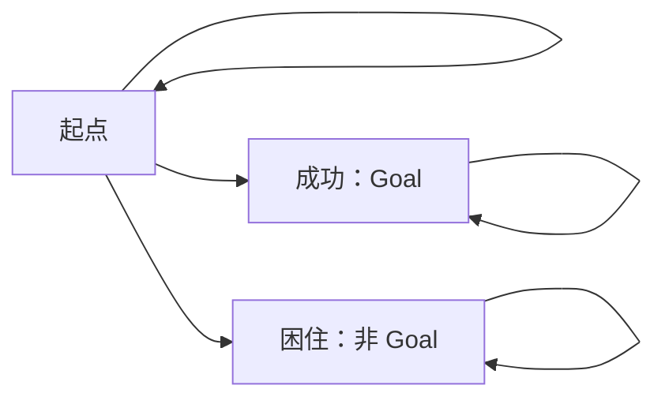

# TLA+ 能检查什么，不能检查什么——中文导读

> 原文：[What TLA+ can and can't check](https://buttondown.com/hillelwayne/archive/what-tla-can-and-cant-check/)
>
> Hillel Wayne，Computer Things，2026-09-30。

本文件包含简要提要和独立概念讲解，不是全文翻译。关于原文措辞和工具能力的核对放在[阅读笔记](notes.md)中。

## 原文提要

作者讨论验证之前的问题：需求能否表达成待检查的性质？不变量和活性覆盖许多重要需求，但“某种执行是否存在”以及“多次执行之间如何比较”需要不同处理。文末又限定了标题中的“不能”：有些问题可以通过辅助变量、组合模型或工具扩展处理，只是会增加建模成本。因此，不能从 TLA+ 擅长检查部分性质，推导出它能包办软件正确性。[原文](https://buttondown.com/hillelwayne/archive/what-tla-can-and-cant-check/)

## 独立讲解：先分清描述对象

| 对象 | 关注什么 | 自编例子 |
| --- | --- | --- |
| 状态条件 | 一份变量取值 | 余额 `balance >= 0` |
| 动作条件 | 当前状态和下一状态的关系 | `balance' >= balance` |
| 行为性质 | 一条状态序列 | 任务最终完成，或者完成后一直保持完成 |

撇号把状态表达式放到下一状态求值；它不是可以任意嵌套在时序公式上的“下一时刻”按钮。动作性质还要处理停顿步，例如 `[][balance' >= balance]_balance` 允许余额增加或不变。[Learn TLA+：Action Properties](https://learntla.com/core/action-properties.html)

## 公式怎样读

下表先沿着**一条行为**解释公式。把它们作为系统性质检查时，还需要考虑规格允许的其他行为。

| 公式 | 含义 |
| --- | --- |
| `[]P` | 从现在起，P 始终成立 |
| `<>P` | P 现在成立，或在将来某个状态成立 |
| `[]<>P` | 从任意位置往后，总还能遇到 P；P 反复成立 |
| `<>[]P` | 从某个位置开始，P 永久成立 |
| `P ~> Q` | 每次 P 成立，Q 当时或最终成立；即 `` |

尤其要分清“反复成立”和“最终稳定成立”。一个值在真、假之间无限交替，满足 `[]<>P`，却不满足 `<>[]P`。[Learn TLA+：Temporal Properties](https://learntla.com/core/temporal-logic.html)

`P ~> Q` 本身也没有表达因果机制、期限或一一对应关系。例如，用“有请求”和“有响应”两个布尔量，未必能区分不同请求。要讨论某个请求最终得到自己的响应，还需要请求身份等模型信息。这里是对公式含义的补充分析。

## “可能成功”与“必然成功”

通常检查 `Spec => Property`，是在问：规格允许的每一条行为，是否都满足 Property？因此 `<>Goal` 中的“最终”仍然位于“每一条行为”的要求之内。[Learn TLA+：Temporal Properties](https://learntla.com/core/temporal-logic.html)

下面是为说明量词而画的概念图，不是运行过的 TLA+ 模型。每个状态都允许停留；从起点还可以进入成功或困住状态。

| 想问的问题 | 在这张图中的答案 | 理由 |
| --- | --- | --- |
| 有没有一条执行最终成功？ | 有 | 起点 → 成功 → 成功…… |
| 每条执行都会最终成功吗？ | 不会 | 起点 → 困住 → 困住…… 是反例 |
| 从每个可达状态出发，都还有成功的路线吗？ | 没有 | 困住状态只能继续困住 |

第一问寻找一种可能，第二问排除所有失败或永远拖延的执行，第三问要求每个可达状态仍保有成功的机会。它们的量词不同，不能互相替换。图中一个起点就足以体现区别；有多个初始状态时，“某个起点存在成功路线”和“每个起点都有成功路线”又要分开。

## 回到实际阅读

读到一个“能检查”或“不能检查”的判断，可以先把需求补成完整句子：检查一条执行中的什么，涉及几条执行，要求存在还是要求全部，以及历史和时间是否已经进入模型。

这能帮助区分两种工作量：写出性质本身，以及建立一个能让该性质准确对应需求的模型。后者做得不充分，即使公式语法正确，也可能检查了另一个问题。具体辨析见[阅读笔记](notes.md)。
